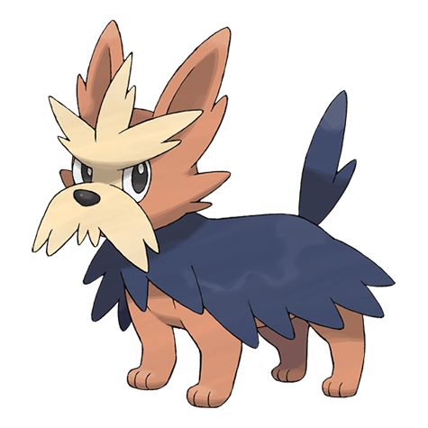

# Herdier (#0507)

*Loyal Dog Pokemon*

**Type:** Normale
**Abilities:** [[Intimidate]], [[Sand Rush]], [[Scrappy]] *(Hidden)*
**Base HP:** 4

> It loyally follows its Trainer’s orders. For ages, they have helped Trainers to raise well behaved Pokemon. It has black, cape-like fur that is very hard and keeps it protected from the weather.

---

## Statistiche (Attributes & Limits)

| Attribute | Base / Limit |
|---|---|
| **Strength** | 2/5 |
| **Dexterity** | 2/4 |
| **Vitality** | 2/4 |
| **Special** | 1/3 |
| **Insight** | 2/4 |

---

## Mosse (Learnset)

- **Starter:** [[Leer|Leer]], [[Tackle|Tackle]]
- **Beginner:** [[Odor_Sleuth|Odor Sleuth]], [[Bite|Bite]], [[Helping_Hand|Helping Hand]]
- **Amateur:** [[Take_Down|Take Down]], [[Work_Up|Work Up]], [[Crunch|Crunch]], [[Roar|Roar]], [[Retaliate|Retaliate]]
- **Ace:** [[Reversal|Reversal]], [[Last_Resort|Last Resort]], [[Giga_Impact|Giga Impact]], [[Play_Rough|Play Rough]]
- **Pro:** [[Lick|Lick]], [[Endure|Endure]], [[Yawn|Yawn]]

---

## Correlati

### Catena Evolutiva
- [[0506_Lillipup|Lillipup]]
- [[0507_Herdier|Herdier]]
- [[0508_Stoutland|Stoutland]]

