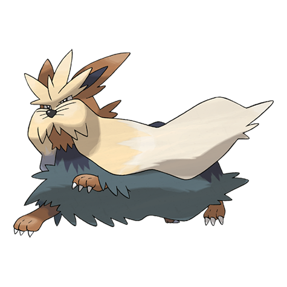

# Stoutland (#0508)

*Big-Hearted Pokemon*

**Type:** Normale
**Abilities:** [[Intimidate]], [[Sand Rush]], [[Scrappy]] *(Hidden)*
**Base HP:** 5

> For many years this Pokemon has helped with rescue missions in hostile places. Its outer coat is hard on the exterior but soft and silky on the inside. They keep people safe and warm while help is on the way.

---

## Statistiche (Attributes & Limits)

| Attribute | Base / Limit |
|---|---|
| **Strength** | 3/6 |
| **Dexterity** | 2/5 |
| **Vitality** | 2/5 |
| **Special** | 2/4 |
| **Insight** | 2/5 |

---

## Mosse (Learnset)

- **Starter:** [[Tackle|Tackle]], [[Leer|Leer]]
- **Beginner:** [[Bite|Bite]], [[Odor_Sleuth|Odor Sleuth]]
- **Amateur:** [[Ice_Fang|Ice Fang]], [[Fire_Fang|Fire Fang]], [[Thunder_Fang|Thunder Fang]], [[Helping_Hand|Helping Hand]], [[Take_Down|Take Down]], [[Work_Up|Work Up]], [[Crunch|Crunch]], [[Roar|Roar]], [[Retaliate|Retaliate]]
- **Ace:** [[Reversal|Reversal]], [[Last_Resort|Last Resort]], [[Giga_Impact|Giga Impact]], [[Play_Rough|Play Rough]]
- **Pro:** [[Psychic_Fangs|Psychic Fangs]], [[Iron_Head|Iron Head]], [[Superpower|Superpower]]

---

## Correlati

### Catena Evolutiva
- [[0506_Lillipup|Lillipup]]
- [[0507_Herdier|Herdier]]
- [[0508_Stoutland|Stoutland]]

