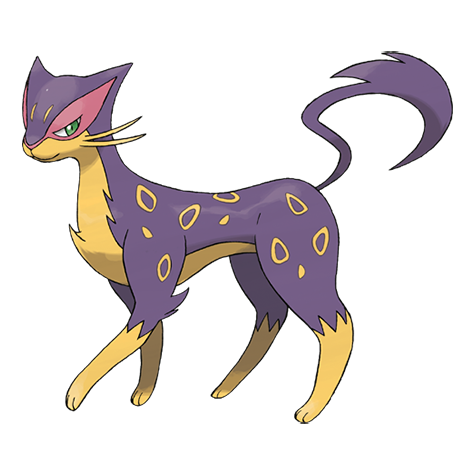

# Liepard (#0510)

*Cruel Pokemon*

**Type:** Buio
**Abilities:** [[Limber]], [[Unburden]], [[Prankster]] *(Hidden)*
**Base HP:** 4

> It’s difficult to see one in the wild. These Pokemon vanish and appear attacking unexpectedly. Many Trainers are drawn to their beautiful fur and elegant appeal. But they can be quite dangerous.

---

## Statistiche (Attributes & Limits)

| Attribute | Base / Limit |
|---|---|
| **Strength** | 2/5 |
| **Dexterity** | 2/6 |
| **Vitality** | 2/4 |
| **Special** | 2/5 |
| **Insight** | 2/4 |

---

## Mosse (Learnset)

- **Starter:** [[Scratch|Scratch]], [[Growl|Growl]]
- **Beginner:** [[Assist|Assist]], [[Sand_Attack|Sand Attack]]
- **Amateur:** [[Fury_Swipes|Fury Swipes]], [[Pursuit|Pursuit]], [[Torment|Torment]], [[Fake_Out|Fake Out]], [[Hone_Claws|Hone Claws]], [[Assurance|Assurance]], [[Slash|Slash]], [[Taunt|Taunt]], [[Snatch|Snatch]]
- **Ace:** [[Night_Slash|Night Slash]], [[Nasty_Plot|Nasty Plot]], [[Sucker_Punch|Sucker Punch]], [[Play_Rough|Play Rough]]
- **Pro:** [[Charm|Charm]], [[Fake_Tears|Fake Tears]], [[Trick|Trick]]

---

## Correlati

### Catena Evolutiva
- [[0509_Purrloin|Purrloin]]
- [[0510_Liepard|Liepard]]

