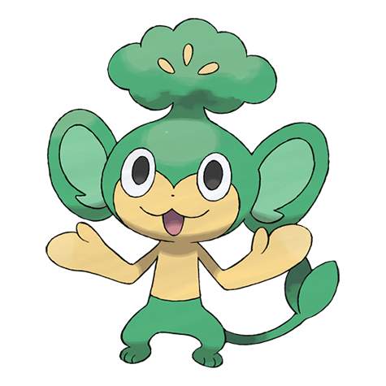

# Pansage (#0511)

*Grass Monkey Pokemon*

**Type:** Erba
**Abilities:** [[Gluttony]], [[Overgrow]] *(Hidden)*
**Base HP:** 3

> Pansage is a friendly Pokemon. It is good at finding berries and will share them with other Pokemon. The leaves on it’s head have medicinal properties, if it finds a sick Pokemon it will offer some to heal it.

---

## Statistiche (Attributes & Limits)

| Attribute | Base / Limit |
|---|---|
| **Strength** | 2/4 |
| **Dexterity** | 2/4 |
| **Vitality** | 2/4 |
| **Special** | 2/4 |
| **Insight** | 2/4 |

---

## Mosse (Learnset)

- **Starter:** [[Scratch|Scratch]], [[Play_Nice|Play Nice]]
- **Beginner:** [[Leer|Leer]], [[Lick|Lick]], [[Vine_Whip|Vine Whip]]
- **Amateur:** [[Fury_Swipes|Fury Swipes]], [[Leech_Seed|Leech Seed]], [[Bite|Bite]], [[Seed_Bomb|Seed Bomb]], [[Torment|Torment]], [[Fling|Fling]], [[Acrobatics|Acrobatics]]
- **Ace:** [[Grass_Knot|Grass Knot]], [[Recycle|Recycle]], [[Natural_Gift|Natural Gift]], [[Crunch|Crunch]]
- **Pro:** [[Grass_Whistle|Grass Whistle]], [[Nasty_Plot|Nasty Plot]], [[Giga_Drain|Giga Drain]]

---

## Correlati

### Catena Evolutiva
- [[0511_Pansage|Pansage]]
- [[0512_Simisage|Simisage]]

