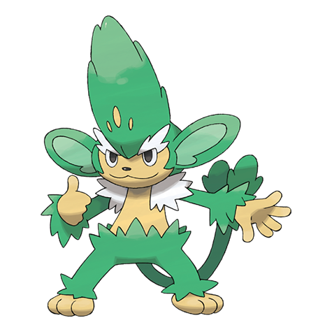

# Simisage (#0512)

*Thorn Monkey Pokemon*

**Type:** Erba
**Abilities:** [[Gluttony]], [[Overgrow]] *(Hidden)*
**Base HP:** 4

> It becomes somewhat ill tempered after it evolves. The leaves on it’s head can be made into a bitter but effective medicine, however it will attack anyone trying to take them with it’s thorned tail.

---

## Statistiche (Attributes & Limits)

| Attribute | Base / Limit |
|---|---|
| **Strength** | 3/6 |
| **Dexterity** | 3/6 |
| **Vitality** | 2/4 |
| **Special** | 3/6 |
| **Insight** | 2/4 |

---

## Mosse (Learnset)

- **Beginner:** [[Leer|Leer]], [[Lick|Lick]]
- **Amateur:** [[Fury_Swipes|Fury Swipes]]
- **Ace:** [[Seed_Bomb|Seed Bomb]]
- **Pro:** [[Synthesis|Synthesis]], [[Disarming_Voice|Disarming Voice]], [[Gunk_Shot|Gunk Shot]]

---

## Correlati

### Catena Evolutiva
- [[0511_Pansage|Pansage]]
- [[0512_Simisage|Simisage]]

