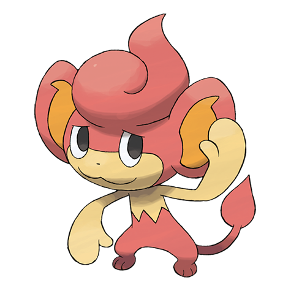

# Pansear (#0513)

*High Temp Pokemon*

**Type:** Fuoco
**Abilities:** [[Gluttony]], [[Blaze]] *(Hidden)*
**Base HP:** 3

> It lives close to volcanic mountains. It’s very intelligent, it roasts berries before eating them and helps lost people. When angered the tuft of hair on it’s head and tail can burst into flames.

---

## Statistiche (Attributes & Limits)

| Attribute | Base / Limit |
|---|---|
| **Strength** | 2/4 |
| **Dexterity** | 2/4 |
| **Vitality** | 2/4 |
| **Special** | 2/4 |
| **Insight** | 2/4 |

---

## Mosse (Learnset)

- **Starter:** [[Scratch|Scratch]], [[Play_Nice|Play Nice]]
- **Beginner:** [[Leer|Leer]], [[Lick|Lick]]
- **Amateur:** [[Incinerate|Incinerate]], [[Fury_Swipes|Fury Swipes]], [[Yawn|Yawn]], [[Bite|Bite]], [[Flame_Burst|Flame Burst]], [[Amnesia|Amnesia]], [[Fling|Fling]], [[Acrobatics|Acrobatics]]
- **Ace:** [[Fire_Blast|Fire Blast]], [[Natural_Gift|Natural Gift]], [[Crunch|Crunch]]
- **Pro:** [[Nasty_Plot|Nasty Plot]], [[Fire_Spin|Fire Spin]], [[Disarming_Voice|Disarming Voice]]

---

## Correlati

### Catena Evolutiva
- [[0513_Pansear|Pansear]]
- [[0514_Simisear|Simisear]]

