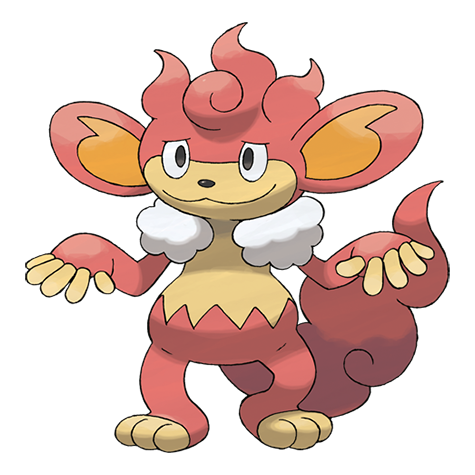

# Simisear (#0514)

*Ember Pokemon*

**Type:** Fuoco
**Abilities:** [[Gluttony]], [[Blaze]] *(Hidden)*
**Base HP:** 4

> A flame burns on top of its head. It scatters embers from its head and tail to sear its opponents. It loves sweets and is not afraid to go near humans to try to get some candy by begging or by stealing.

---

## Statistiche (Attributes & Limits)

| Attribute | Base / Limit |
|---|---|
| **Strength** | 3/6 |
| **Dexterity** | 3/6 |
| **Vitality** | 2/4 |
| **Special** | 3/6 |
| **Insight** | 2/4 |

---

## Mosse (Learnset)

- **Beginner:** [[Leer|Leer]], [[Lick|Lick]]
- **Amateur:** [[Fury_Swipes|Fury Swipes]]
- **Ace:** [[Flame_Burst|Flame Burst]]
- **Pro:** [[Gunk_Shot|Gunk Shot]], [[Superpower|Superpower]], [[Heat_Wave|Heat Wave]]

---

## Correlati

### Catena Evolutiva
- [[0513_Pansear|Pansear]]
- [[0514_Simisear|Simisear]]

