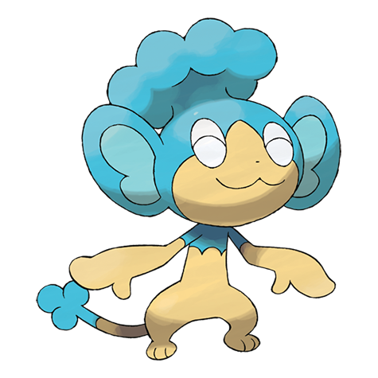

# Panpour (#0515)

*Spray Pokemon*

**Type:** Acqua
**Abilities:** [[Gluttony]], [[Torrent]] *(Hidden)*
**Base HP:** 3

> It does not thrive in dry climates. It keeps itself damp by shooting the water stored in its head tuft. Its water is valued by gardeners and Grass Pokemon breeders as it makes plants grow beautiful.

---

## Statistiche (Attributes & Limits)

| Attribute | Base / Limit |
|---|---|
| **Strength** | 2/4 |
| **Dexterity** | 2/4 |
| **Vitality** | 2/4 |
| **Special** | 2/4 |
| **Insight** | 2/4 |

---

## Mosse (Learnset)

- **Starter:** [[Scratch|Scratch]], [[Play_Nice|Play Nice]]
- **Beginner:** [[Leer|Leer]], [[Lick|Lick]], [[Water_Gun|Water Gun]]
- **Amateur:** [[Fury_Swipes|Fury Swipes]], [[Water_Sport|Water Sport]], [[Bite|Bite]], [[Scald|Scald]], [[Taunt|Taunt]], [[Fling|Fling]], [[Acrobatics|Acrobatics]]
- **Ace:** [[Brine|Brine]], [[Recycle|Recycle]], [[Natural_Gift|Natural Gift]], [[Crunch|Crunch]]
- **Pro:** [[Nasty_Plot|Nasty Plot]], [[Aqua_Tail|Aqua Tail]], [[Disarming_Voice|Disarming Voice]]

---

## Correlati

### Catena Evolutiva
- [[0515_Panpour|Panpour]]
- [[0516_Simipour|Simipour]]

