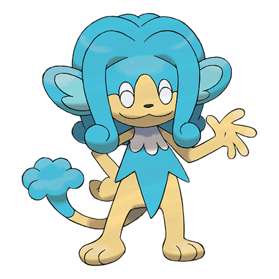

# Simipour (#0516)

*Geyser Pokemon*

**Type:** Acqua
**Abilities:** [[Gluttony]], [[Torrent]] *(Hidden)*
**Base HP:** 4

> It prefers places with clean water. When its tuft runs low, it replenishes it by siphoning water up with its tail. It is said that if you see a Simipour Swimming in a pond, the water is safe to drink.

---

## Statistiche (Attributes & Limits)

| Attribute | Base / Limit |
|---|---|
| **Strength** | 3/6 |
| **Dexterity** | 3/6 |
| **Vitality** | 2/4 |
| **Special** | 3/6 |
| **Insight** | 2/4 |

---

## Mosse (Learnset)

- **Beginner:** [[Leer|Leer]], [[Lick|Lick]]
- **Amateur:** [[Fury_Swipes|Fury Swipes]]
- **Ace:** [[Scald|Scald]]
- **Pro:** [[Aqua_Ring|Aqua Ring]], [[Hydro_Pump|Hydro Pump]], [[Gunk_Shot|Gunk Shot]]

---

## Correlati

### Catena Evolutiva
- [[0515_Panpour|Panpour]]
- [[0516_Simipour|Simipour]]

