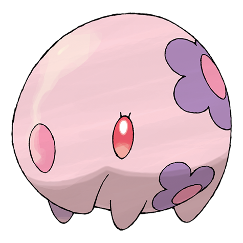

# Munna (#0517)

*Dream Eater Pokemon*

**Type:** Psico
**Abilities:** [[Forewarn]], [[Synchronize]], [[Telepathy]] *(Hidden)*
**Base HP:** 3

> It lurks close to towns and eats the dreams of people and Pokemon. When it eats a pleasant dream, it expels pink-colored mist. If you forgot what you dreamed, a Munna must have eaten your dream.

---

## Statistiche (Attributes & Limits)

| Attribute | Base / Limit |
|---|---|
| **Strength** | 1/3 |
| **Dexterity** | 1/3 |
| **Vitality** | 2/4 |
| **Special** | 2/4 |
| **Insight** | 2/4 |

---

## Mosse (Learnset)

- **Starter:** [[Psywave|Psywave]], [[Defense_Curl|Defense Curl]]
- **Beginner:** [[Lucky_Chant|Lucky Chant]], [[Yawn|Yawn]], [[Psybeam|Psybeam]]
- **Amateur:** [[Imprison|Imprison]], [[Moonlight|Moonlight]], [[Hypnosis|Hypnosis]], [[Zen_Headbutt|Zen Headbutt]], [[Calm_Mind|Calm Mind]], [[Nightmare|Nightmare]], [[Dream_Eater|Dream Eater]], [[Psychic|Psychic]]
- **Ace:** [[Synchronoise|Synchronoise]], [[Telekinesis|Telekinesis]], [[Future_Sight|Future Sight]], [[Stored_Power|Stored Power]]
- **Pro:** [[Heal_Bell|Heal Bell]], [[Pain_Split|Pain Split]], [[Healing_Wish|Healing Wish]]

---

## Correlati

### Catena Evolutiva
- [[0517_Munna|Munna]]
- [[0518_Musharna|Musharna]]

