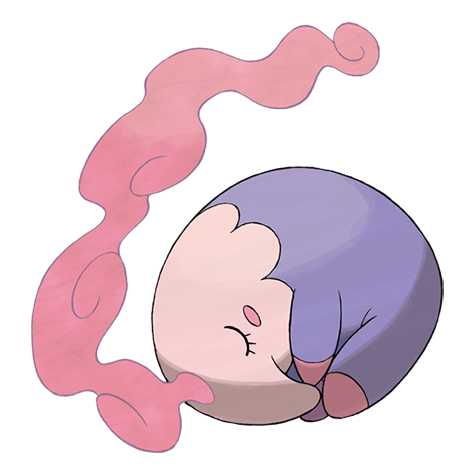

# Musharna (#0518)

*Drowsing Pokemon*

**Type:** Psico
**Abilities:** [[Forewarn]], [[Synchronize]], [[Telepathy]] *(Hidden)*
**Base HP:** 6

> It communicates with the mist on its forehead, it can create shapes and images from dreams it has eaten. It is said that this Pokemon is a link between this world and a another one made entirely of dreams.

---

## Statistiche (Attributes & Limits)

| Attribute | Base / Limit |
|---|---|
| **Strength** | 2/4 |
| **Dexterity** | 1/3 |
| **Vitality** | 2/5 |
| **Special** | 3/6 |
| **Insight** | 3/6 |

---

## Mosse (Learnset)

- **Starter:** [[Psychic_Terrain|Psychic Terrain]]
- **Beginner:** [[Defense_Curl|Defense Curl]]
- **Amateur:** [[Psybeam|Psybeam]], [[Hypnosis|Hypnosis]]
- **Ace:** [[Lucky_Chant|Lucky Chant]]
- **Pro:** [[Pain_Split|Pain Split]], [[Heal_Bell|Heal Bell]], [[Healing_Wish|Healing Wish]]

---

## Correlati

### Catena Evolutiva
- [[0517_Munna|Munna]]
- [[0518_Musharna|Musharna]]

