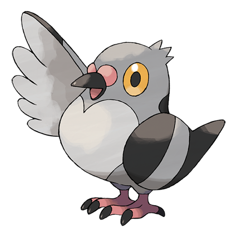

# Pidove (#0519)

*Tiny Pigeon Pokemon*

**Type:** Normale / Volante
**Abilities:** [[Big Pecks]], [[Super Luck]], [[Rivalry]] *(Hidden)*
**Base HP:** 3

> These Pokemon thrive in the cities. They are accustomed to people and they often gather in the parks. They are forgetful and not very smart, but they always remember the way back home.

---

## Statistiche (Attributes & Limits)

| Attribute | Base / Limit |
|---|---|
| **Strength** | 2/4 |
| **Dexterity** | 1/3 |
| **Vitality** | 2/4 |
| **Special** | 1/3 |
| **Insight** | 1/3 |

---

## Mosse (Learnset)

- **Starter:** [[Gust|Gust]], [[Growl|Growl]]
- **Beginner:** [[Leer|Leer]], [[Quick_Attack|Quick Attack]], [[Air_Cutter|Air Cutter]]
- **Amateur:** [[Roost|Roost]], [[Detect|Detect]], [[Taunt|Taunt]], [[Air_Slash|Air Slash]], [[Razor_Wind|Razor Wind]], [[Feather_Dance|Feather Dance]]
- **Ace:** [[Swagger|Swagger]], [[Facade|Facade]], [[Tailwind|Tailwind]], [[Sky_Attack|Sky Attack]]
- **Pro:** [[Steel_Wing|Steel Wing]], [[Lucky_Chant|Lucky Chant]], [[Hypnosis|Hypnosis]]

---

## Correlati

### Catena Evolutiva
- [[0519_Pidove|Pidove]]
- [[0520_Tranquill|Tranquill]]
- [[0521_Unfezant|Unfezant]]

