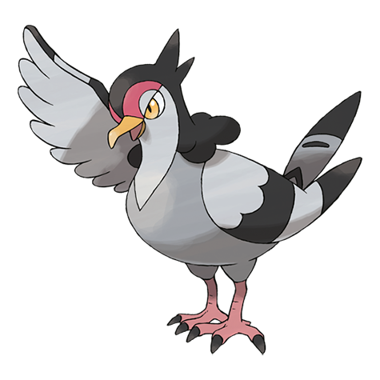

# Tranquill (#0520)

*Wild Pigeon Pokemon*

**Type:** Normale / Volante
**Abilities:** [[Big Pecks]], [[Super Luck]], [[Rivalry]] *(Hidden)*
**Base HP:** 4

> During war and old times people made use of Tranquil’s sense of location to send letters. It will never fail to find it’s way back home. They like quiet forests and enjoy to relax in the peace and quiet.

---

## Statistiche (Attributes & Limits)

| Attribute | Base / Limit |
|---|---|
| **Strength** | 2/5 |
| **Dexterity** | 2/4 |
| **Vitality** | 2/4 |
| **Special** | 2/4 |
| **Insight** | 1/3 |

---

## Mosse (Learnset)

- **Starter:** [[Gust|Gust]], [[Growl|Growl]]
- **Beginner:** [[Leer|Leer]], [[Quick_Attack|Quick Attack]], [[Air_Cutter|Air Cutter]]
- **Amateur:** [[Roost|Roost]], [[Detect|Detect]], [[Taunt|Taunt]], [[Air_Slash|Air Slash]], [[Razor_Wind|Razor Wind]], [[Feather_Dance|Feather Dance]]
- **Ace:** [[Swagger|Swagger]], [[Facade|Facade]], [[Tailwind|Tailwind]], [[Sky_Attack|Sky Attack]]
- **Pro:** [[Steel_Wing|Steel Wing]], [[Lucky_Chant|Lucky Chant]], [[Hypnosis|Hypnosis]]

---

## Correlati

### Catena Evolutiva
- [[0519_Pidove|Pidove]]
- [[0520_Tranquill|Tranquill]]
- [[0521_Unfezant|Unfezant]]

