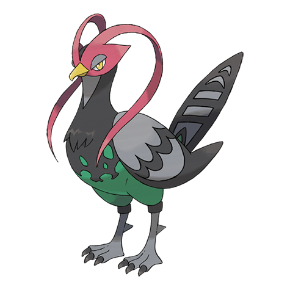

# Unfezant (#0521)

*Proud Pokemon*

**Type:** Normale / Volante
**Abilities:** [[Big Pecks]], [[Super Luck]], [[Rivalry]] *(Hidden)*
**Base HP:** 5

> Males swing the beautiful plumage on their heads to threaten others and to court females. Although less visually appealing, females are better at flying. Once they form a pair they are mated for life.

---

## Statistiche (Attributes & Limits)

| Attribute | Base / Limit |
|---|---|
| **Strength** | 3/6 |
| **Dexterity** | 2/5 |
| **Vitality** | 2/5 |
| **Special** | 2/4 |
| **Insight** | 2/4 |

---

## Mosse (Learnset)

- **Starter:** [[Gust|Gust]], [[Growl|Growl]]
- **Beginner:** [[Leer|Leer]], [[Quick_Attack|Quick Attack]]
- **Amateur:** [[Air_Cutter|Air Cutter]], [[Roost|Roost]], [[Detect|Detect]], [[Taunt|Taunt]], [[Air_Slash|Air Slash]], [[Razor_Wind|Razor Wind]], [[Feather_Dance|Feather Dance]]
- **Ace:** [[Swagger|Swagger]], [[Facade|Facade]], [[Tailwind|Tailwind]], [[Sky_Attack|Sky Attack]]
- **Pro:** [[Heat_Wave|Heat Wave]], [[Night_Slash|Night Slash]], [[Lucky_Chant|Lucky Chant]]

---

## Correlati

### Catena Evolutiva
- [[0519_Pidove|Pidove]]
- [[0520_Tranquill|Tranquill]]
- [[0521_Unfezant|Unfezant]]

