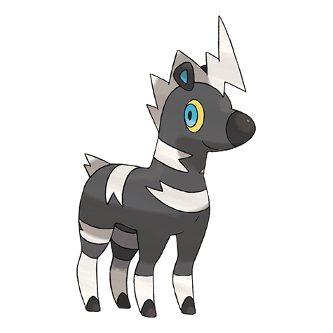

# Blitzle (#0522)

*Electrified Pokemon*

**Type:** Elettro
**Abilities:** [[Lightning Rod]], [[Motor Drive]], [[Sap Sipper]] *(Hidden)*
**Base HP:** 3

> When storm clouds cover the plains you can see them running around chasing the lightnings to absorb them on their mane. They form big herds and use the pattern on their skin to confuse predators.

---

## Statistiche (Attributes & Limits)

| Attribute | Base / Limit |
|---|---|
| **Strength** | 2/4 |
| **Dexterity** | 2/5 |
| **Vitality** | 1/3 |
| **Special** | 2/4 |
| **Insight** | 1/3 |

---

## Mosse (Learnset)

- **Starter:** [[Quick_Attack|Quick Attack]], [[Tail_Whip|Tail Whip]]
- **Beginner:** [[Charge|Charge]], [[Shock_Wave|Shock Wave]]
- **Amateur:** [[Thunder_Wave|Thunder Wave]], [[Flame_Charge|Flame Charge]], [[Pursuit|Pursuit]], [[Spark|Spark]], [[Stomp|Stomp]], [[Wild_Charge|Wild Charge]]
- **Ace:** [[Agility|Agility]], [[Discharge|Discharge]], [[Thrash|Thrash]]
- **Pro:** [[Me_First|Me First]], [[Bounce|Bounce]], [[Double_Kick|Double Kick]]

---

## Correlati

### Catena Evolutiva
- [[0522_Blitzle|Blitzle]]
- [[0523_Zebstrika|Zebstrika]]

