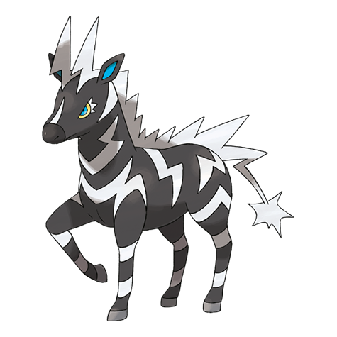

# Zebstrika (#0523)

*Thunderbolt Pokemon*

**Type:** Elettro
**Abilities:** [[Lightning Rod]], [[Motor Drive]], [[Sap Sipper]] *(Hidden)*
**Base HP:** 4

> It is very ill tempered and wild, there have been very few cases of it being successfully tamed. It can shoot lightning from it’s mane in all directions. If you try to mount it without warning it will shock you.

---

## Statistiche (Attributes & Limits)

| Attribute | Base / Limit |
|---|---|
| **Strength** | 3/6 |
| **Dexterity** | 3/6 |
| **Vitality** | 2/4 |
| **Special** | 2/5 |
| **Insight** | 2/4 |

---

## Mosse (Learnset)

- **Starter:** [[Quick_Attack|Quick Attack]], [[Tail_Whip|Tail Whip]]
- **Beginner:** [[Shock_Wave|Shock Wave]], [[Charge|Charge]]
- **Amateur:** [[Thunder_Wave|Thunder Wave]], [[Ion_Deluge|Ion Deluge]], [[Flame_Charge|Flame Charge]], [[Pursuit|Pursuit]], [[Spark|Spark]], [[Stomp|Stomp]], [[Wild_Charge|Wild Charge]]
- **Ace:** [[Agility|Agility]], [[Discharge|Discharge]], [[Thrash|Thrash]]
- **Pro:** [[Bounce|Bounce]], [[Double_Kick|Double Kick]], [[Screech|Screech]]

---

## Correlati

### Catena Evolutiva
- [[0522_Blitzle|Blitzle]]
- [[0523_Zebstrika|Zebstrika]]

