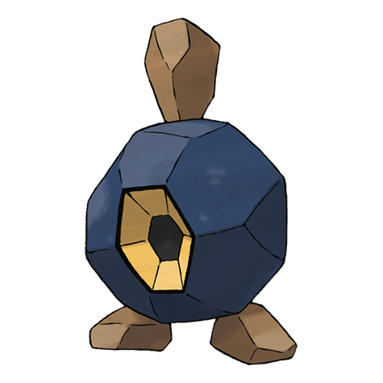

# Roggenrola (#0524)

*Mantle Pokemon*

**Type:** Roccia
**Abilities:** [[Sturdy]], [[Weak Armor]], [[Sand Force]] *(Hidden)*
**Base HP:** 3

> It is made from compressed rock, making it’s body almost as hard as steel. It is blind, what looks like it’s eye is really an ear, for this reason it can live in the darkest of caves feeding on rocks to grow stronger.

---

## Statistiche (Attributes & Limits)

| Attribute | Base / Limit |
|---|---|
| **Strength** | 2/5 |
| **Dexterity** | 1/2 |
| **Vitality** | 2/5 |
| **Special** | 1/3 |
| **Insight** | 1/3 |

---

## Mosse (Learnset)

- **Starter:** [[Tackle|Tackle]], [[Harden|Harden]]
- **Beginner:** [[Sand_Attack|Sand Attack]], [[Headbutt|Headbutt]]
- **Amateur:** [[Rock_Blast|Rock Blast]], [[Mud_Slap|Mud Slap]], [[Iron_Defense|Iron Defense]], [[Smack_Down|Smack Down]], [[Rock_Slide|Rock Slide]], [[Stealth_Rock|Stealth Rock]]
- **Ace:** [[Sandstorm|Sandstorm]], [[Stone_Edge|Stone Edge]], [[Explosion|Explosion]]
- **Pro:** [[Autotomize|Autotomize]], [[Lock_On|Lock-On]], [[Magnitude|Magnitude]]

---

## Correlati

### Catena Evolutiva
- [[0524_Roggenrola|Roggenrola]]
- [[0525_Boldore|Boldore]]
- [[0526_Gigalith|Gigalith]]

