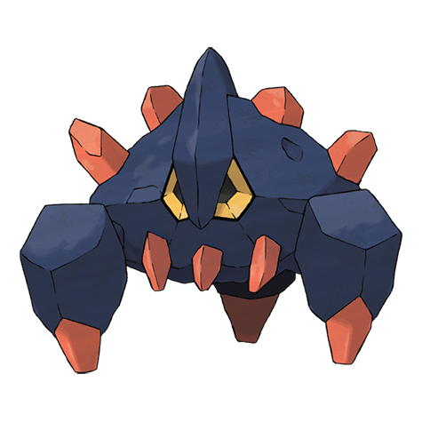

# Boldore (#0525)

*Ore Pokemon*

**Type:** Roccia
**Abilities:** [[Sturdy]], [[Weak Armor]], [[Sand Force]] *(Hidden)*
**Base HP:** 4

> It releases the excess of energy in the form of red crystals. It is still blind, it looks for for water sources inside underground caves by using echo location. It is a pacific creature that keeps to itself most of the time.

---

## Statistiche (Attributes & Limits)

| Attribute | Base / Limit |
|---|---|
| **Strength** | 3/6 |
| **Dexterity** | 1/2 |
| **Vitality** | 3/6 |
| **Special** | 2/4 |
| **Insight** | 1/3 |

---

## Mosse (Learnset)

- **Starter:** [[Tackle|Tackle]], [[Harden|Harden]]
- **Beginner:** [[Sand_Attack|Sand Attack]], [[Headbutt|Headbutt]]
- **Amateur:** [[Rock_Blast|Rock Blast]], [[Mud_Slap|Mud Slap]], [[Iron_Defense|Iron Defense]], [[Smack_Down|Smack Down]], [[Power_Gem|Power Gem]], [[Rock_Slide|Rock Slide]], [[Stealth_Rock|Stealth Rock]]
- **Ace:** [[Sandstorm|Sandstorm]], [[Stone_Edge|Stone Edge]], [[Explosion|Explosion]]
- **Pro:** [[Autotomize|Autotomize]], [[Magnitude|Magnitude]], [[Wide_Guard|Wide Guard]]

---

## Correlati

### Catena Evolutiva
- [[0524_Roggenrola|Roggenrola]]
- [[0525_Boldore|Boldore]]
- [[0526_Gigalith|Gigalith]]

