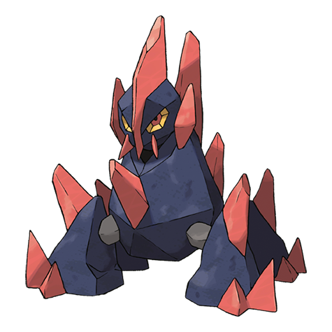

# Gigalith (#0526)

*Compressed Pokemon*

**Type:** Roccia
**Abilities:** [[Sturdy]], [[Sand Stream]], [[Sand Force]] *(Hidden)*
**Base HP:** 5

> It is a serious Pokemon that doesn’t interact with others too much. It uses the sharp crystals in it’s body to recharge using the sun’s energy. If angered it can bury it’s foe under giant rock slides or explode at will.

---

## Statistiche (Attributes & Limits)

| Attribute | Base / Limit |
|---|---|
| **Strength** | 3/7 |
| **Dexterity** | 1/3 |
| **Vitality** | 3/7 |
| **Special** | 2/4 |
| **Insight** | 2/5 |

---

## Mosse (Learnset)

- **Starter:** [[Tackle|Tackle]], [[Harden|Harden]]
- **Beginner:** [[Sand_Attack|Sand Attack]], [[Headbutt|Headbutt]]
- **Amateur:** [[Rock_Blast|Rock Blast]], [[Mud_Slap|Mud Slap]], [[Iron_Defense|Iron Defense]], [[Smack_Down|Smack Down]], [[Power_Gem|Power Gem]], [[Rock_Slide|Rock Slide]], [[Stealth_Rock|Stealth Rock]]
- **Ace:** [[Sandstorm|Sandstorm]], [[Stone_Edge|Stone Edge]], [[Explosion|Explosion]]
- **Pro:** [[Heavy_Slam|Heavy Slam]], [[Wide_Guard|Wide Guard]], [[Superpower|Superpower]]

---

## Correlati

### Catena Evolutiva
- [[0524_Roggenrola|Roggenrola]]
- [[0525_Boldore|Boldore]]
- [[0526_Gigalith|Gigalith]]

