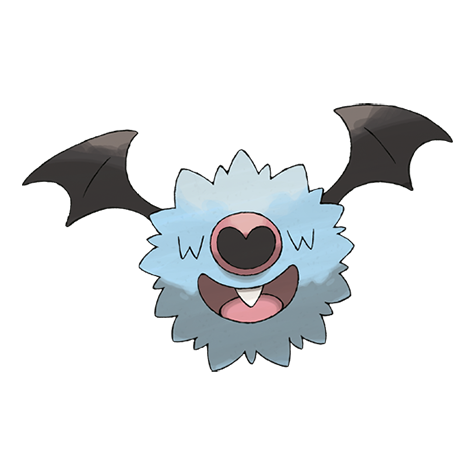

# Woobat (#0527)

*Bat Pokemon*

**Type:** Psico / Volante
**Abilities:** [[Unaware]], [[Klutz]], [[Simple]] *(Hidden)*
**Base HP:** 3

> It lives in dark forests and caves. Emits ultrasonic waves from its nose it learns about its surroundings. The two small eyes it has get covered by its own fur. It clings to trees and cave walls to sleep at night.

---

## Statistiche (Attributes & Limits)

| Attribute | Base / Limit |
|---|---|
| **Strength** | 2/4 |
| **Dexterity** | 2/5 |
| **Vitality** | 1/3 |
| **Special** | 2/4 |
| **Insight** | 1/3 |

---

## Mosse (Learnset)

- **Starter:** [[Confusion|Confusion]], [[Odor_Sleuth|Odor Sleuth]]
- **Beginner:** [[Gust|Gust]]
- **Amateur:** [[Assurance|Assurance]], [[Heart_Stamp|Heart Stamp]], [[Imprison|Imprison]], [[Air_Cutter|Air Cutter]], [[Attract|Attract]], [[Amnesia|Amnesia]], [[Calm_Mind|Calm Mind]], [[Psychic|Psychic]]
- **Ace:** [[Future_Sight|Future Sight]], [[Air_Slash|Air Slash]], [[Endeavor|Endeavor]]
- **Pro:** [[Roost|Roost]], [[Giga_Drain|Giga Drain]], [[Heat_Wave|Heat Wave]]

---

## Correlati

### Catena Evolutiva
- [[0527_Woobat|Woobat]]
- [[0528_Swoobat|Swoobat]]

