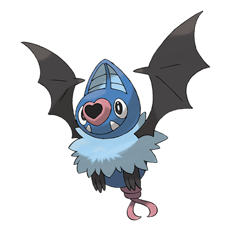

# Swoobat (#0528)

*Courting Pokemon*

**Type:** Psico / Volante
**Abilities:** [[Unaware]], [[Klutz]], [[Simple]] *(Hidden)*
**Base HP:** 4

> They communicate by emitting ultrasonic waves through their noses. This sound is not perceived by humans but it can affect their mood and emotions. It hunts Bug Pokemon and loves fresh fruit.

---

## Statistiche (Attributes & Limits)

| Attribute | Base / Limit |
|---|---|
| **Strength** | 2/4 |
| **Dexterity** | 3/6 |
| **Vitality** | 2/4 |
| **Special** | 2/5 |
| **Insight** | 2/4 |

---

## Mosse (Learnset)

- **Starter:** [[Confusion|Confusion]], [[Odor_Sleuth|Odor Sleuth]]
- **Beginner:** [[Gust|Gust]]
- **Amateur:** [[Assurance|Assurance]], [[Heart_Stamp|Heart Stamp]], [[Imprison|Imprison]], [[Air_Cutter|Air Cutter]], [[Attract|Attract]], [[Amnesia|Amnesia]], [[Calm_Mind|Calm Mind]], [[Psychic|Psychic]]
- **Ace:** [[Future_Sight|Future Sight]], [[Air_Slash|Air Slash]], [[Endeavor|Endeavor]]
- **Pro:** [[Roost|Roost]], [[Giga_Drain|Giga Drain]], [[Heat_Wave|Heat Wave]]

---

## Correlati

### Catena Evolutiva
- [[0527_Woobat|Woobat]]
- [[0528_Swoobat|Swoobat]]

