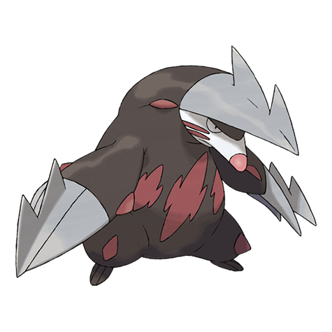

# Excadrill (#0530)

*Subterrene Pokemon*

**Type:** Terra / Acciaio
**Abilities:** [[Sand Rush]], [[Sand Force]], [[Mold Breaker]] *(Hidden)*
**Base HP:** 5

> They build maze-like nests deep underground. Humans make use of their drilling abilities to dig tunnels for subway trains. This Pokemon does not back out from foes and can be a formidable opponent.

---

## Statistiche (Attributes & Limits)

| Attribute | Base / Limit |
|---|---|
| **Strength** | 3/7 |
| **Dexterity** | 2/5 |
| **Vitality** | 2/4 |
| **Special** | 2/4 |
| **Insight** | 2/4 |

---

## Mosse (Learnset)

- **Starter:** [[Mud_Sport|Mud Sport]], [[Scratch|Scratch]]
- **Beginner:** [[Mud_Slap|Mud Slap]], [[Rapid_Spin|Rapid Spin]]
- **Amateur:** [[Metal_Claw|Metal Claw]], [[Fury_Swipes|Fury Swipes]], [[Hone_Claws|Hone Claws]], [[Dig|Dig]], [[Rock_Slide|Rock Slide]], [[Slash|Slash]], [[Sandstorm|Sandstorm]], [[Horn_Drill|Horn Drill]], [[Rototiller|Rototiller]]
- **Ace:** [[Swords_Dance|Swords Dance]], [[Earthquake|Earthquake]], [[Drill_Run|Drill Run]], [[Fissure|Fissure]]
- **Pro:** [[Iron_Defense|Iron Defense]], [[Smart_Strike|Smart Strike]], [[Iron_Head|Iron Head]]

---

## Correlati

### Catena Evolutiva
- [[0529_Drilbur|Drilbur]]
- [[0530_Excadrill|Excadrill]]

