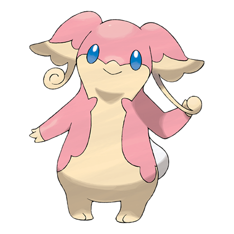
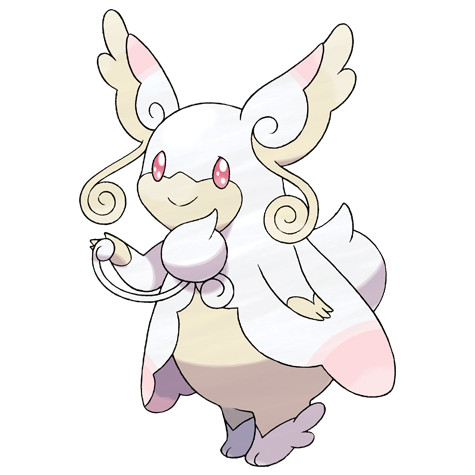

# Audino (#0531)

*Hearing Pokemon*

**Type:** Normale
**Abilities:** [[Healer]], [[Regenerator]], [[Klutz]] *(Hidden)*
**Base HP:** 5

> Its auditory sense is astounding, using the feelers on it’s ears it can know the health state of others. It is a caring Pokemon with a sweet disposition to help, but it is not too common to see in the wild.

---

## Statistiche (Attributes & Limits)

| Attribute | Base / Limit |
|---|---|
| **Strength** | 2/4 |
| **Dexterity** | 2/4 |
| **Vitality** | 2/5 |
| **Special** | 2/4 |
| **Insight** | 2/5 |

---

## Mosse (Learnset)

- **Starter:** [[Play_Nice|Play Nice]], [[Pound|Pound]], [[Growl|Growl]], [[Helping_Hand|Helping Hand]]
- **Beginner:** [[Hyper_Voice|Hyper Voice]], [[Misty_Terrain|Misty Terrain]], [[Refresh|Refresh]], [[Baby_Doll_Eyes|Baby-Doll Eyes]], [[Double_Slap|Double Slap]]
- **Amateur:** [[Disarming_Voice|Disarming Voice]], [[Secret_Power|Secret Power]], [[Attract|Attract]], [[Take_Down|Take Down]], [[Entrainment|Entrainment]], [[Heal_Pulse|Heal Pulse]]
- **Ace:** [[After_You|After You]], [[Double_Edge|Double-Edge]], [[Simple_Beam|Simple Beam]], [[Last_Resort|Last Resort]]
- **Pro:** [[Draining_Kiss|Draining Kiss]], [[Wish|Wish]], [[Heal_Bell|Heal Bell]]

---

## Correlati

### Catena Evolutiva
- [[0531_Audino|Audino]]
- Audino (Mega Form)

---

## Mega Audino (#0531M1)

**Type:** Normale / Folletto
**Abilities:** [[Inner Focus]]
**Base HP:** 6

| Attribute | Base / Limit |
|---|---|
| **Strength** | 2/4 |
| **Dexterity** | 2/4 |
| **Vitality** | 3/7 |
| **Special** | 2/5 |
| **Insight** | 3/7 |

### Mosse

- **Starter:** [[Play_Nice|Play Nice]], [[Pound|Pound]], [[Growl|Growl]], [[Helping_Hand|Helping Hand]]
- **Beginner:** [[Hyper_Voice|Hyper Voice]], [[Misty_Terrain|Misty Terrain]], [[Refresh|Refresh]], [[Baby_Doll_Eyes|Baby-Doll Eyes]], [[Double_Slap|Double Slap]]
- **Amateur:** [[Disarming_Voice|Disarming Voice]], [[Secret_Power|Secret Power]], [[Attract|Attract]], [[Take_Down|Take Down]], [[Entrainment|Entrainment]], [[Heal_Pulse|Heal Pulse]]
- **Ace:** [[After_You|After You]], [[Double_Edge|Double-Edge]], [[Simple_Beam|Simple Beam]], [[Last_Resort|Last Resort]]
- **Pro:** [[Draining_Kiss|Draining Kiss]], [[Wish|Wish]], [[Heal_Bell|Heal Bell]]

