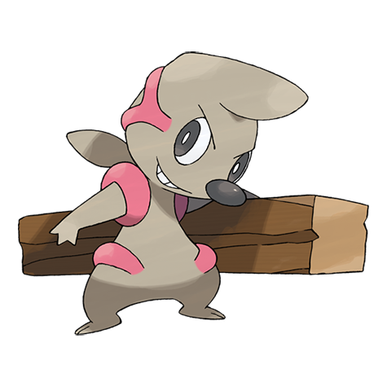

# Timburr (#0532)

*Muscular Pokemon*

**Type:** Lotta
**Abilities:** [[Guts]], [[Sheer Force]], [[Iron Fist]] *(Hidden)*
**Base HP:** 3

> They carry a big log as a tool and as a weapon. You may see them helping with construction work as they strive to challenge their strength. When it can swing the log without problems it is close to evolve.

---

## Statistiche (Attributes & Limits)

| Attribute | Base / Limit |
|---|---|
| **Strength** | 2/5 |
| **Dexterity** | 1/3 |
| **Vitality** | 2/4 |
| **Special** | 1/3 |
| **Insight** | 1/3 |

---

## Mosse (Learnset)

- **Starter:** [[Pound|Pound]], [[Leer|Leer]]
- **Beginner:** [[Focus_Energy|Focus Energy]], [[Bide|Bide]]
- **Amateur:** [[Low_Kick|Low Kick]], [[Rock_Throw|Rock Throw]], [[Wake_Up_Slap|Wake-Up Slap]], [[Chip_Away|Chip Away]], [[Bulk_Up|Bulk Up]], [[Rock_Slide|Rock Slide]], [[Dynamic_Punch|Dynamic Punch]], [[Scary_Face|Scary Face]]
- **Ace:** [[Hammer_Arm|Hammer Arm]], [[Stone_Edge|Stone Edge]], [[Focus_Punch|Focus Punch]], [[Superpower|Superpower]]
- **Pro:** [[Foresight|Foresight]], [[Mach_Punch|Mach Punch]], [[Detect|Detect]]

---

## Correlati

### Catena Evolutiva
- [[0532_Timburr|Timburr]]
- [[0533_Gurdurr|Gurdurr]]
- [[0534_Conkeldurr|Conkeldurr]]

