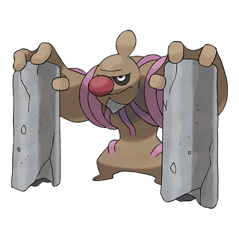

# Conkeldurr (#0534)

*Muscular Pokemon*

**Type:** Lotta
**Abilities:** [[Guts]], [[Sheer Force]], [[Iron Fist]] *(Hidden)*
**Base HP:** 6

> They use concrete pillars as walking canes and swing the pillars freely in battle. Anthropology research says that this Pokemon may have taught humans how to make concrete out of rocks thousands of years ago.

---

## Statistiche (Attributes & Limits)

| Attribute | Base / Limit |
|---|---|
| **Strength** | 3/7 |
| **Dexterity** | 2/4 |
| **Vitality** | 3/6 |
| **Special** | 2/4 |
| **Insight** | 2/4 |

---

## Mosse (Learnset)

- **Starter:** [[Pound|Pound]], [[Leer|Leer]]
- **Beginner:** [[Focus_Energy|Focus Energy]], [[Bide|Bide]]
- **Amateur:** [[Low_Kick|Low Kick]], [[Rock_Throw|Rock Throw]], [[Wake_Up_Slap|Wake-Up Slap]], [[Chip_Away|Chip Away]], [[Bulk_Up|Bulk Up]], [[Rock_Slide|Rock Slide]], [[Dynamic_Punch|Dynamic Punch]], [[Scary_Face|Scary Face]]
- **Ace:** [[Hammer_Arm|Hammer Arm]], [[Stone_Edge|Stone Edge]], [[Focus_Punch|Focus Punch]], [[Superpower|Superpower]]
- **Pro:** [[Foresight|Foresight]], [[Drain_Punch|Drain Punch]], [[Wide_Guard|Wide Guard]]

---

## Correlati

### Catena Evolutiva
- [[0532_Timburr|Timburr]]
- [[0533_Gurdurr|Gurdurr]]
- [[0534_Conkeldurr|Conkeldurr]]

