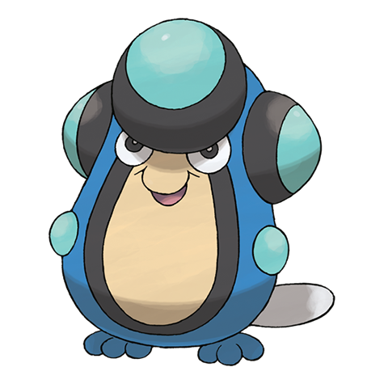

# Palpitoad (#0536)

*Vibration Pokemon*

**Type:** Acqua / Terra
**Abilities:** [[Swift Swim]], [[Hydration]], [[Water Absorb]] *(Hidden)*
**Base HP:** 4

> It lives both in water and land. It uses its long, sticky tongue to capture prey. When they vibrate the bumps on their heads, they can make waves in the water and even earthquake-like vibrations on land.

---

## Statistiche (Attributes & Limits)

| Attribute | Base / Limit |
|---|---|
| **Strength** | 2/4 |
| **Dexterity** | 2/4 |
| **Vitality** | 2/4 |
| **Special** | 2/4 |
| **Insight** | 2/4 |

---

## Mosse (Learnset)

- **Starter:** [[Bubble|Bubble]], [[Growl|Growl]]
- **Beginner:** [[Supersonic|Supersonic]], [[Round|Round]]
- **Amateur:** [[Bubble_Beam|Bubble Beam]], [[Mud_Shot|Mud Shot]], [[Aqua_Ring|Aqua Ring]], [[Uproar|Uproar]], [[Muddy_Water|Muddy Water]], [[Echoed_Voice|Echoed Voice]]
- **Ace:** [[Flail|Flail]], [[Rain_Dance|Rain Dance]], [[Hydro_Pump|Hydro Pump]], [[Hyper_Voice|Hyper Voice]]
- **Pro:** [[Earth_Power|Earth Power]], [[Refresh|Refresh]], [[Icy_Wind|Icy Wind]]

---

## Correlati

### Catena Evolutiva
- [[0535_Tympole|Tympole]]
- [[0536_Palpitoad|Palpitoad]]
- [[0537_Seismitoad|Seismitoad]]

