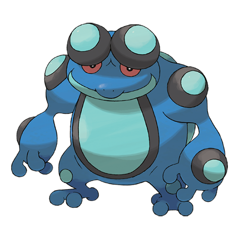

# Seismitoad (#0537)

*Vibration Pokemon*

**Type:** Acqua / Terra
**Abilities:** [[Swift Swim]], [[Poison Touch]], [[Water Absorb]] *(Hidden)*
**Base HP:** 6

> It is only found in a few marshes, and rarely seen on clean water. They shoot a paralyzing liquid from their head bumps and use the vibrations on their bumps to harm their foes.

---

## Statistiche (Attributes & Limits)

| Attribute | Base / Limit |
|---|---|
| **Strength** | 2/6 |
| **Dexterity** | 2/5 |
| **Vitality** | 2/5 |
| **Special** | 2/5 |
| **Insight** | 2/5 |

---

## Mosse (Learnset)

- **Starter:** [[Bubble|Bubble]], [[Growl|Growl]]
- **Beginner:** [[Supersonic|Supersonic]], [[Round|Round]]
- **Amateur:** [[Bubble_Beam|Bubble Beam]], [[Mud_Shot|Mud Shot]], [[Aqua_Ring|Aqua Ring]], [[Uproar|Uproar]], [[Muddy_Water|Muddy Water]], [[Echoed_Voice|Echoed Voice]], [[Acid|Acid]]
- **Ace:** [[Flail|Flail]], [[Drain_Punch|Drain Punch]], [[Rain_Dance|Rain Dance]], [[Hydro_Pump|Hydro Pump]], [[Hyper_Voice|Hyper Voice]]
- **Pro:** [[Earth_Power|Earth Power]], [[Bounce|Bounce]], [[Knock_Off|Knock Off]]

---

## Correlati

### Catena Evolutiva
- [[0535_Tympole|Tympole]]
- [[0536_Palpitoad|Palpitoad]]
- [[0537_Seismitoad|Seismitoad]]

