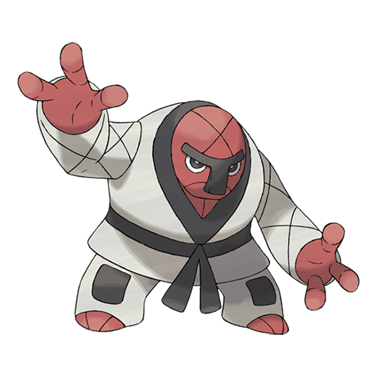

# Throh (#0538)

*Judo Pokemon*

**Type:** Lotta
**Abilities:** [[Guts]], [[Inner Focus]], [[Mold Breaker]] *(Hidden)*
**Base HP:** 6

> When they encounter foes bigger than themselves, they try to throw them away. In the wild they always travel in packs of five and make their clothes and belts out of plants and vines.

---

## Statistiche (Attributes & Limits)

| Attribute | Base / Limit |
|---|---|
| **Strength** | 3/7 |
| **Dexterity** | 2/4 |
| **Vitality** | 2/5 |
| **Special** | 1/3 |
| **Insight** | 2/5 |

---

## Mosse (Learnset)

- **Starter:** [[Bind|Bind]], [[Leer|Leer]]
- **Beginner:** [[Focus_Energy|Focus Energy]], [[Bide|Bide]], [[Seismic_Toss|Seismic Toss]]
- **Amateur:** [[Mat_Block|Mat Block]], [[Vital_Throw|Vital Throw]], [[Revenge|Revenge]], [[Storm_Throw|Storm Throw]], [[Body_Slam|Body Slam]], [[Bulk_Up|Bulk Up]], [[Endure|Endure]]
- **Ace:** [[Circle_Throw|Circle Throw]], [[Wide_Guard|Wide Guard]], [[Superpower|Superpower]], [[Reversal|Reversal]]
- **Pro:** [[Fire_Punch|Fire Punch]], [[Ice_Punch|Ice Punch]], [[Thunder_Punch|Thunder Punch]]

---

