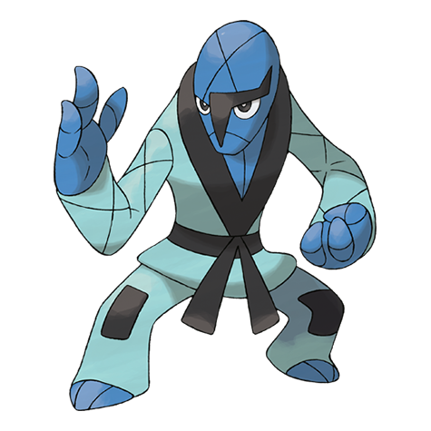

# Sawk (#0539)

*Karate Pokemon*

**Type:** Lotta
**Abilities:** [[Sturdy]], [[Inner Focus]], [[Mold Breaker]] *(Hidden)*
**Base HP:** 4

> This Pokemon is entirely dedicated to becoming stronger. Many have secluded in the mountains to train all day. Wild ones make their clothes out of plants and vines they find. Sawk and Throh train together.

---

## Statistiche (Attributes & Limits)

| Attribute | Base / Limit |
|---|---|
| **Strength** | 3/7 |
| **Dexterity** | 2/5 |
| **Vitality** | 2/5 |
| **Special** | 1/3 |
| **Insight** | 2/5 |

---

## Mosse (Learnset)

- **Starter:** [[Rock_Smash|Rock Smash]], [[Leer|Leer]]
- **Beginner:** [[Bide|Bide]], [[Focus_Energy|Focus Energy]]
- **Amateur:** [[Double_Kick|Double Kick]], [[Low_Sweep|Low Sweep]], [[Counter|Counter]], [[Karate_Chop|Karate Chop]], [[Brick_Break|Brick Break]], [[Bulk_Up|Bulk Up]], [[Retaliate|Retaliate]], [[Endure|Endure]]
- **Ace:** [[Quick_Guard|Quick Guard]], [[Close_Combat|Close Combat]], [[Reversal|Reversal]]
- **Pro:** [[Dual_Chop|Dual Chop]], [[Helping_Hand|Helping Hand]], [[Block|Block]]

---

