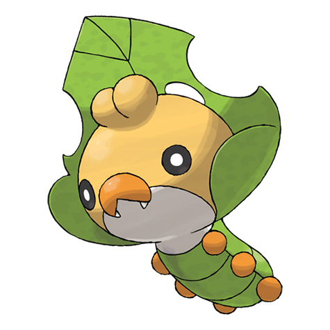

# Sewaddle (#0540)

*Sewing Pokemon*

**Type:** Insetto / Erba
**Abilities:** [[Swarm]], [[Chlorophyll]], [[Overcoat]] *(Hidden)*
**Base HP:** 3

> It is a sweet Pokemon that loves its family. It hides its head in the leaf hood while it is sleeping. The silk they produce it’s highly valued to make expensive clothing, this makes it a popular pet for fashion designers.

---

## Statistiche (Attributes & Limits)

| Attribute | Base / Limit |
|---|---|
| **Strength** | 2/4 |
| **Dexterity** | 1/3 |
| **Vitality** | 2/5 |
| **Special** | 1/3 |
| **Insight** | 2/4 |

---

## Mosse (Learnset)

- **Starter:** [[Tackle|Tackle]], [[String_Shot|String Shot]]
- **Beginner:** [[Bug_Bite|Bug Bite]]
- **Amateur:** [[Razor_Leaf|Razor Leaf]], [[Struggle_Bug|Struggle Bug]], [[Endure|Endure]], [[Sticky_Web|Sticky Web]]
- **Ace:** [[Bug_Buzz|Bug Buzz]], [[Flail|Flail]]
- **Pro:** [[Baton_Pass|Baton Pass]], [[Camouflage|Camouflage]], [[Silver_Wind|Silver Wind]]

---

## Correlati

### Catena Evolutiva
- [[0540_Sewaddle|Sewaddle]]
- [[0541_Swadloon|Swadloon]]
- [[0542_Leavanny|Leavanny]]

