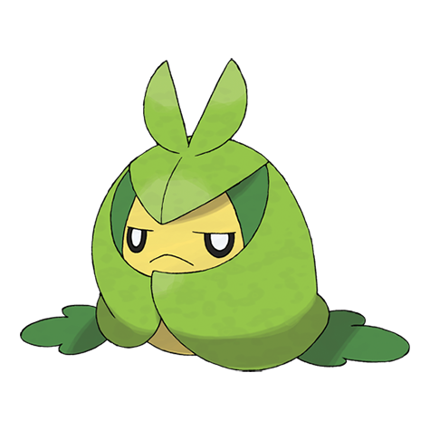

# Swadloon (#0541)

*Leaf-Wrapped Pokemon*

**Type:** Insetto / Erba
**Abilities:** [[Leaf Guard]], [[Chlorophyll]], [[Overcoat]] *(Hidden)*
**Base HP:** 4

> Preferring dark and damp places, it spends the entire day inside rotting logs. It protects itself from the cold by wrapping up in leaves. It’s kind of moody and it likes to remain undisturbed.

---

## Statistiche (Attributes & Limits)

| Attribute | Base / Limit |
|---|---|
| **Strength** | 2/4 |
| **Dexterity** | 1/3 |
| **Vitality** | 2/5 |
| **Special** | 2/4 |
| **Insight** | 2/5 |

---

## Mosse (Learnset)

- **Starter:** [[String_Shot|String Shot]], [[Tackle|Tackle]]
- **Beginner:** [[Razor_Leaf|Razor Leaf]], [[Bug_Bite|Bug Bite]]
- **Amateur:** [[Grass_Whistle|Grass Whistle]]
- **Ace:** [[Protect|Protect]]
- **Pro:** [[Camouflage|Camouflage]], [[Iron_Defense|Iron Defense]], [[Seed_Bomb|Seed Bomb]]

---

## Correlati

### Catena Evolutiva
- [[0540_Sewaddle|Sewaddle]]
- [[0541_Swadloon|Swadloon]]
- [[0542_Leavanny|Leavanny]]

