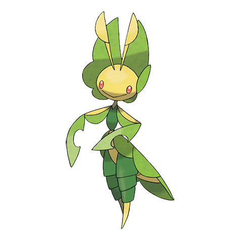

# Leavanny (#0542)

*Nurturing Pokemon*

**Type:** Insetto / Erba
**Abilities:** [[Swarm]], [[Chlorophyll]], [[Overcoat]] *(Hidden)*
**Base HP:** 5

> It is a gentle and caring Pokemon. Mostly known for making clothes out of leaves and silk for any small pokemon it finds. It warms and protects its eggs making nests of fermenting leaves.

---

## Statistiche (Attributes & Limits)

| Attribute | Base / Limit |
|---|---|
| **Strength** | 3/6 |
| **Dexterity** | 2/5 |
| **Vitality** | 2/5 |
| **Special** | 2/5 |
| **Insight** | 2/5 |

---

## Mosse (Learnset)

- **Starter:** [[String_Shot|String Shot]], [[Tackle|Tackle]]
- **Beginner:** [[Razor_Leaf|Razor Leaf]], [[Bug_Bite|Bug Bite]], [[False_Swipe|False Swipe]]
- **Amateur:** [[Struggle_Bug|Struggle Bug]], [[Slash|Slash]], [[Helping_Hand|Helping Hand]], [[Fell_Stinger|Fell Stinger]], [[Leaf_Blade|Leaf Blade]]
- **Ace:** [[X_Scissor|X-Scissor]], [[Entrainment|Entrainment]], [[Swords_Dance|Swords Dance]], [[Leaf_Storm|Leaf Storm]]
- **Pro:** [[Agility|Agility]], [[Synthesis|Synthesis]], [[Screech|Screech]]

---

## Correlati

### Catena Evolutiva
- [[0540_Sewaddle|Sewaddle]]
- [[0541_Swadloon|Swadloon]]
- [[0542_Leavanny|Leavanny]]

