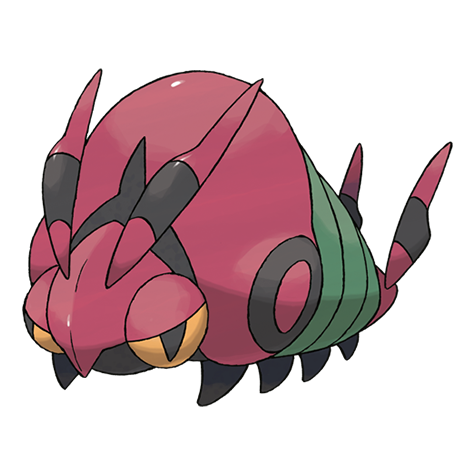

# Venipede (#0543)

*Centipede Pokemon*

**Type:** Insetto / Veleno
**Abilities:** [[Poison Point]], [[Swarm]], [[Speed Boost]] *(Hidden)*
**Base HP:** 3

> Incredibly aggressive for a Pokemon that size. It uses the feelers on it’s front and back to locate things around. Its bite injects a potent venom, enough to deter the large bird Pokemon that try to prey on it.

---

## Statistiche (Attributes & Limits)

| Attribute | Base / Limit |
|---|---|
| **Strength** | 2/4 |
| **Dexterity** | 2/4 |
| **Vitality** | 2/4 |
| **Special** | 1/3 |
| **Insight** | 1/3 |

---

## Mosse (Learnset)

- **Starter:** [[Defense_Curl|Defense Curl]], [[Rollout|Rollout]]
- **Beginner:** [[Poison_Sting|Poison Sting]], [[Screech|Screech]]
- **Amateur:** [[Pursuit|Pursuit]], [[Protect|Protect]], [[Poison_Tail|Poison Tail]], [[Bug_Bite|Bug Bite]], [[Venoshock|Venoshock]], [[Agility|Agility]], [[Toxic|Toxic]]
- **Ace:** [[Steamroller|Steamroller]], [[Rock_Climb|Rock Climb]], [[Double_Edge|Double-Edge]]
- **Pro:** [[Toxic_Spikes|Toxic Spikes]], [[Spikes|Spikes]], [[Pin_Missile|Pin Missile]]

---

## Correlati

### Catena Evolutiva
- [[0543_Venipede|Venipede]]
- [[0544_Whirlipede|Whirlipede]]
- [[0545_Scolipede|Scolipede]]

