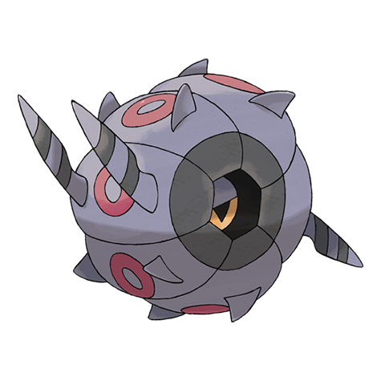

# Whirlipede (#0544)

*Curlipede Pokemon*

**Type:** Insetto / Veleno
**Abilities:** [[Poison Point]], [[Swarm]], [[Speed Boost]] *(Hidden)*
**Base HP:** 4

> It is usually motionless, when it is attacked, it rotates at high speed and then crashes into its opponent with its body full of poison spikes. Inside it is storing energy for evolving, which normally takes a few months.

---

## Statistiche (Attributes & Limits)

| Attribute | Base / Limit |
|---|---|
| **Strength** | 2/4 |
| **Dexterity** | 2/4 |
| **Vitality** | 3/6 |
| **Special** | 1/3 |
| **Insight** | 2/5 |

---

## Mosse (Learnset)

- **Starter:** [[Defense_Curl|Defense Curl]], [[Rollout|Rollout]]
- **Beginner:** [[Poison_Sting|Poison Sting]], [[Screech|Screech]]
- **Amateur:** [[Pursuit|Pursuit]], [[Protect|Protect]], [[Poison_Tail|Poison Tail]], [[Iron_Defense|Iron Defense]], [[Bug_Bite|Bug Bite]], [[Toxic|Toxic]], [[Agility|Agility]]
- **Ace:** [[Steamroller|Steamroller]], [[Venoshock|Venoshock]], [[Venom_Drench|Venom Drench]], [[Rock_Climb|Rock Climb]], [[Double_Edge|Double-Edge]]
- **Pro:** [[Toxic_Spikes|Toxic Spikes]], [[Spikes|Spikes]], [[Pin_Missile|Pin Missile]]

---

## Correlati

### Catena Evolutiva
- [[0543_Venipede|Venipede]]
- [[0544_Whirlipede|Whirlipede]]
- [[0545_Scolipede|Scolipede]]

