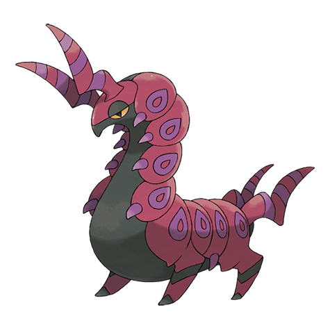

# Scolipede (#0545)

*Megapede Pokemon*

**Type:** Insetto / Veleno
**Abilities:** [[Poison Point]], [[Swarm]], [[Speed Boost]] *(Hidden)*
**Base HP:** 8

> Highly aggressive, it uses the claws on its neck to immobilize its prey and then inject them with poison to finish them off. Be very careful around this Pokemon as it will chase you relentlessly until it gets you.

---

## Statistiche (Attributes & Limits)

| Attribute | Base / Limit |
|---|---|
| **Strength** | 2/5 |
| **Dexterity** | 3/6 |
| **Vitality** | 2/5 |
| **Special** | 1/3 |
| **Insight** | 2/4 |

---

## Mosse (Learnset)

- **Starter:** [[Defense_Curl|Defense Curl]], [[Rollout|Rollout]]
- **Beginner:** [[Poison_Sting|Poison Sting]], [[Screech|Screech]]
- **Amateur:** [[Pursuit|Pursuit]], [[Protect|Protect]], [[Poison_Tail|Poison Tail]], [[Bug_Bite|Bug Bite]], [[Venoshock|Venoshock]], [[Baton_Pass|Baton Pass]], [[Agility|Agility]], [[Toxic|Toxic]]
- **Ace:** [[Steamroller|Steamroller]], [[Venom_Drench|Venom Drench]], [[Rock_Climb|Rock Climb]], [[Double_Edge|Double-Edge]], [[Megahorn|Megahorn]]
- **Pro:** [[Smart_Strike|Smart Strike]], [[Aqua_Tail|Aqua Tail]], [[Superpower|Superpower]]

---

## Correlati

### Catena Evolutiva
- [[0543_Venipede|Venipede]]
- [[0544_Whirlipede|Whirlipede]]
- [[0545_Scolipede|Scolipede]]

