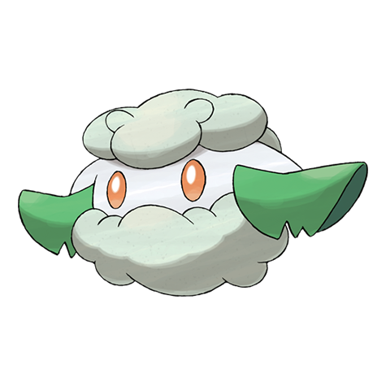

# Cottonee (#0546)

*Cotton Puff Pokemon*

**Type:** Erba / Folletto
**Abilities:** [[Prankster]], [[Infiltrator]], [[Chlorophyll]] *(Hidden)*
**Base HP:** 3

> They go wherever the wind takes them. On rainy days they can’t float, so they take shelter beneath big trees. To defend from predators they shed their cotton and leave it as a decoy while they escape.

---

## Statistiche (Attributes & Limits)

| Attribute | Base / Limit |
|---|---|
| **Strength** | 1/3 |
| **Dexterity** | 2/4 |
| **Vitality** | 2/4 |
| **Special** | 1/3 |
| **Insight** | 2/4 |

---

## Mosse (Learnset)

- **Starter:** [[Absorb|Absorb]], [[Fairy_Wind|Fairy Wind]]
- **Beginner:** [[Growth|Growth]], [[Leech_Seed|Leech Seed]], [[Stun_Spore|Stun Spore]]
- **Amateur:** [[Mega_Drain|Mega Drain]], [[Cotton_Spore|Cotton Spore]], [[Razor_Leaf|Razor Leaf]], [[Poison_Powder|Poison Powder]], [[Helping_Hand|Helping Hand]], [[Charm|Charm]], [[Energy_Ball|Energy Ball]]
- **Ace:** [[Giga_Drain|Giga Drain]], [[Cotton_Guard|Cotton Guard]], [[Sunny_Day|Sunny Day]], [[Endeavor|Endeavor]], [[Solar_Beam|Solar Beam]]
- **Pro:** [[Beat_Up|Beat Up]], [[Fake_Tears|Fake Tears]], [[Encore|Encore]]

---

## Correlati

### Catena Evolutiva
- [[0546_Cottonee|Cottonee]]
- [[0547_Whimsicott|Whimsicott]]

