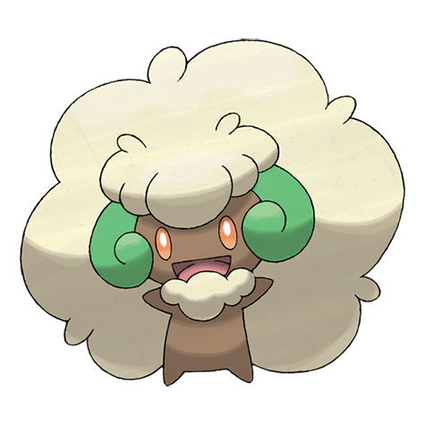

# Whimsicott (#0547)

*Windveiled Pokemon*

**Type:** Erba / Folletto
**Abilities:** [[Prankster]], [[Infiltrator]], [[Chlorophyll]] *(Hidden)*
**Base HP:** 4

> Riding whirlwinds, they appear and disappear. These Pokemon sneak through even the smallest gaps into houses and cause all sorts of mischief the balls of white fluff it leaves behind reveal its presence.

---

## Statistiche (Attributes & Limits)

| Attribute | Base / Limit |
|---|---|
| **Strength** | 2/4 |
| **Dexterity** | 3/6 |
| **Vitality** | 2/5 |
| **Special** | 2/5 |
| **Insight** | 2/5 |

---

## Mosse (Learnset)

- **Starter:** [[Growth|Growth]], [[Leech_Seed|Leech Seed]]
- **Beginner:** [[Mega_Drain|Mega Drain]], [[Cotton_Spore|Cotton Spore]]
- **Amateur:** [[Gust|Gust]], [[Tailwind|Tailwind]], [[Moonblast|Moonblast]]
- **Ace:** [[Hurricane|Hurricane]]
- **Pro:** [[Fake_Tears|Fake Tears]], [[Memento|Memento]], [[Encore|Encore]]

---

## Correlati

### Catena Evolutiva
- [[0546_Cottonee|Cottonee]]
- [[0547_Whimsicott|Whimsicott]]

