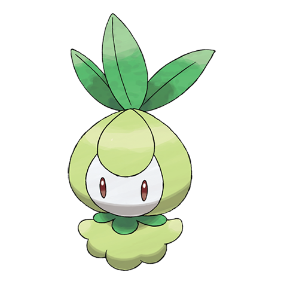

# Petilil (#0548)

*Bulb Pokemon*

**Type:** Erba
**Abilities:** [[Chlorophyll]], [[Own Tempo]], [[Leaf Guard]] *(Hidden)*
**Base HP:** 3

> Since they prefer moist and nutritive soil, the areas where Petilil live are known to be good for growing plants. The leaves on its head can be used for medicinal purposes, but they are extra bitter.

---

## Statistiche (Attributes & Limits)

| Attribute | Base / Limit |
|---|---|
| **Strength** | 1/3 |
| **Dexterity** | 1/3 |
| **Vitality** | 2/4 |
| **Special** | 2/5 |
| **Insight** | 2/4 |

---

## Mosse (Learnset)

- **Starter:** [[Absorb|Absorb]], [[Growth|Growth]]
- **Beginner:** [[Leech_Seed|Leech Seed]], [[Sleep_Powder|Sleep Powder]]
- **Amateur:** [[Mega_Drain|Mega Drain]], [[Synthesis|Synthesis]], [[Magical_Leaf|Magical Leaf]], [[Stun_Spore|Stun Spore]], [[Helping_Hand|Helping Hand]], [[Aromatherapy|Aromatherapy]], [[Energy_Ball|Energy Ball]]
- **Ace:** [[Giga_Drain|Giga Drain]], [[Entrainment|Entrainment]], [[Sunny_Day|Sunny Day]], [[After_You|After You]], [[Leaf_Storm|Leaf Storm]]
- **Pro:** [[Charm|Charm]], [[Heal_Bell|Heal Bell]], [[Grass_Whistle|Grass Whistle]]

---

## Correlati

### Catena Evolutiva
- [[0548_Petilil|Petilil]]
- [[0549_Lilligant|Lilligant]]

