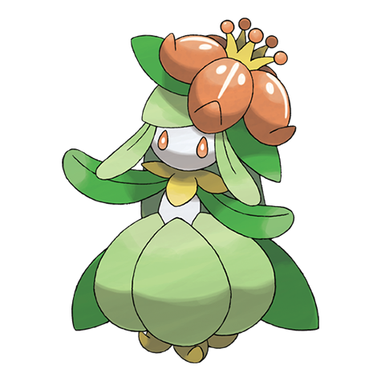

# Lilligant (#0549)

*Flowering Pokemon*

**Type:** Erba
**Abilities:** [[Chlorophyll]], [[Own Tempo]], [[Leaf Guard]] *(Hidden)*
**Base HP:** 4

> Even veteran gardeners face a challenge in getting its beautiful flower to bloom as it withers with ease. This Pokemon is popular among celebrities due to it’s grace, elegance and delicious aroma.

---

## Statistiche (Attributes & Limits)

| Attribute | Base / Limit |
|---|---|
| **Strength** | 2/4 |
| **Dexterity** | 2/5 |
| **Vitality** | 2/5 |
| **Special** | 3/6 |
| **Insight** | 2/5 |

---

## Mosse (Learnset)

- **Starter:** [[Growth|Growth]]
- **Beginner:** [[Leech_Seed|Leech Seed]]
- **Amateur:** [[Mega_Drain|Mega Drain]], [[Synthesis|Synthesis]], [[Teeter_Dance|Teeter Dance]], [[Petal_Dance|Petal Dance]]
- **Ace:** [[Quiver_Dance|Quiver Dance]], [[Petal_Blizzard|Petal Blizzard]]
- **Pro:** [[Sweet_Scent|Sweet Scent]], [[Healing_Wish|Healing Wish]], [[Ingrain|Ingrain]]

---

## Correlati

### Catena Evolutiva
- [[0548_Petilil|Petilil]]
- [[0549_Lilligant|Lilligant]]

