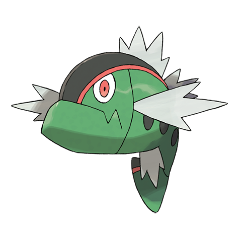

# Basculin (#0550)

*Hostile Pokemon*

**Type:** Acqua
**Abilities:** [[Reckless]], [[Adaptability]], [[Mold Breaker]] *(Hidden)*
**Base HP:** 4

> Two variants exist of the same Pokemon, a blue one and a red one but they don’t get along as they compete for territory and prey. These Pokemon are very hostile, but also delicious when grilled.

---

## Statistiche (Attributes & Limits)

| Attribute | Base / Limit |
|---|---|
| **Strength** | 2/5 |
| **Dexterity** | 2/5 |
| **Vitality** | 2/4 |
| **Special** | 2/5 |
| **Insight** | 2/4 |

---

## Mosse (Learnset)

- **Starter:** [[Tail_Whip|Tail Whip]], [[Tackle|Tackle]], [[Water_Gun|Water Gun]]
- **Beginner:** [[Uproar|Uproar]], [[Headbutt|Headbutt]], [[Bite|Bite]]
- **Amateur:** [[Aqua_Jet|Aqua Jet]], [[Chip_Away|Chip Away]], [[Take_Down|Take Down]], [[Crunch|Crunch]], [[Aqua_Tail|Aqua Tail]], [[Soak|Soak]], [[Flail|Flail]], [[Scary_Face|Scary Face]]
- **Ace:** [[Double_Edge|Double-Edge]], [[Head_Smash|Head Smash]], [[Final_Gambit|Final Gambit]], [[Thrash|Thrash]]
- **Pro:** [[Agility|Agility]], [[Muddy_Water|Muddy Water]], [[Superpower|Superpower]]

---

