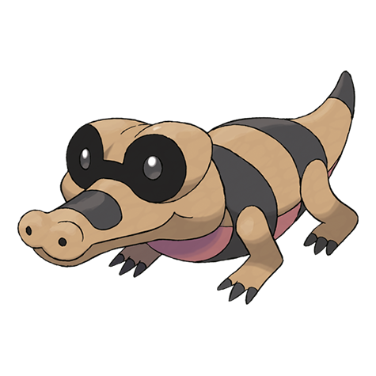

# Sandile (#0551)

*Desert Croc Pokemon*

**Type:** Terra / Buio
**Abilities:** [[Intimidate]], [[Moxie]], [[Anger Point]] *(Hidden)*
**Base HP:** 3

> They live hidden under the desert sands with only their eyes and nostrils visible. They don’t prey on anything bigger than themselves but can be troublesome if they are being leaded by one of it’s evolved forms.

---

## Statistiche (Attributes & Limits)

| Attribute | Base / Limit |
|---|---|
| **Strength** | 2/5 |
| **Dexterity** | 2/4 |
| **Vitality** | 1/3 |
| **Special** | 1/3 |
| **Insight** | 1/3 |

---

## Mosse (Learnset)

- **Starter:** [[Leer|Leer]], [[Rage|Rage]]
- **Beginner:** [[Bite|Bite]], [[Sand_Attack|Sand Attack]], [[Torment|Torment]]
- **Amateur:** [[Sand_Tomb|Sand Tomb]], [[Assurance|Assurance]], [[Mud_Slap|Mud Slap]], [[Embargo|Embargo]], [[Swagger|Swagger]], [[Crunch|Crunch]], [[Dig|Dig]], [[Scary_Face|Scary Face]]
- **Ace:** [[Foul_Play|Foul Play]], [[Sandstorm|Sandstorm]], [[Earthquake|Earthquake]], [[Thrash|Thrash]]
- **Pro:** [[Beat_Up|Beat Up]], [[Thunder_Fang|Thunder Fang]], [[Aqua_Tail|Aqua Tail]]

---

## Correlati

### Catena Evolutiva
- [[0551_Sandile|Sandile]]
- [[0552_Krokorok|Krokorok]]
- [[0553_Krookodile|Krookodile]]

