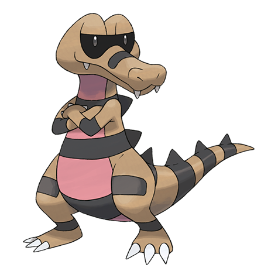

# Krokorok (#0552)

*Desert Croc Pokemon*

**Type:** Terra / Buio
**Abilities:** [[Intimidate]], [[Moxie]], [[Anger Point]] *(Hidden)*
**Base HP:** 4

> The protective membranes shield their eyes from sandstorms and allow them to see in the dark. They can be aggressive and territorial and love to destroy things with their fangs.

---

## Statistiche (Attributes & Limits)

| Attribute | Base / Limit |
|---|---|
| **Strength** | 2/5 |
| **Dexterity** | 2/5 |
| **Vitality** | 2/4 |
| **Special** | 2/4 |
| **Insight** | 2/4 |

---

## Mosse (Learnset)

- **Starter:** [[Leer|Leer]], [[Rage|Rage]]
- **Beginner:** [[Bite|Bite]], [[Sand_Attack|Sand Attack]], [[Torment|Torment]]
- **Amateur:** [[Sand_Tomb|Sand Tomb]], [[Assurance|Assurance]], [[Mud_Slap|Mud Slap]], [[Embargo|Embargo]], [[Swagger|Swagger]], [[Crunch|Crunch]], [[Dig|Dig]], [[Scary_Face|Scary Face]]
- **Ace:** [[Foul_Play|Foul Play]], [[Sandstorm|Sandstorm]], [[Earthquake|Earthquake]], [[Thrash|Thrash]]
- **Pro:** [[Beat_Up|Beat Up]], [[Thunder_Fang|Thunder Fang]], [[Aqua_Tail|Aqua Tail]]

---

## Correlati

### Catena Evolutiva
- [[0551_Sandile|Sandile]]
- [[0552_Krokorok|Krokorok]]
- [[0553_Krookodile|Krookodile]]

