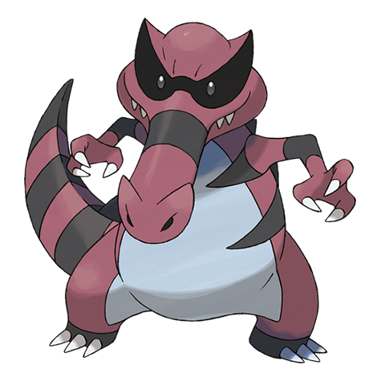

# Krookodile (#0553)

*Intimidation Pokemon*

**Type:** Terra / Buio
**Abilities:** [[Intimidate]], [[Moxie]], [[Anger Point]] *(Hidden)*
**Base HP:** 5

> A very violent Pokemon. They try to clamp down on anything that moves in front of their eyes and once grasped they never let the prey escape. It can be very dangerous if it’s not tamed correctly.

---

## Statistiche (Attributes & Limits)

| Attribute | Base / Limit |
|---|---|
| **Strength** | 3/6 |
| **Dexterity** | 2/5 |
| **Vitality** | 2/5 |
| **Special** | 2/4 |
| **Insight** | 2/5 |

---

## Mosse (Learnset)

- **Starter:** [[Rage|Rage]], [[Leer|Leer]]
- **Beginner:** [[Sand_Attack|Sand Attack]], [[Bite|Bite]], [[Torment|Torment]]
- **Amateur:** [[Power_Trip|Power Trip]], [[Sand_Tomb|Sand Tomb]], [[Assurance|Assurance]], [[Mud_Slap|Mud Slap]], [[Embargo|Embargo]], [[Swagger|Swagger]], [[Crunch|Crunch]], [[Dig|Dig]], [[Scary_Face|Scary Face]]
- **Ace:** [[Foul_Play|Foul Play]], [[Sandstorm|Sandstorm]], [[Earthquake|Earthquake]], [[Outrage|Outrage]]
- **Pro:** [[Fire_Fang|Fire Fang]], [[Iron_Tail|Iron Tail]], [[Superpower|Superpower]]

---

## Correlati

### Catena Evolutiva
- [[0551_Sandile|Sandile]]
- [[0552_Krokorok|Krokorok]]
- [[0553_Krookodile|Krookodile]]

