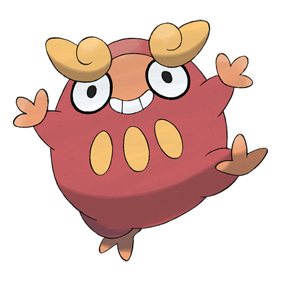

# Darumaka (#0554)

*Zen Charm Pokemon*

**Type:** Fuoco
**Abilities:** [[Hustle]], [[Inner Focus]] *(Hidden)*
**Base HP:** 3

> Lives on deserts and arid terrains. It has a flame inside its body. When the flame burns brightly it becomes very active running around, when the flame is low it falls asleep. Their droppings double as a bonfire.

---

## Statistiche (Attributes & Limits)

| Attribute | Base / Limit |
|---|---|
| **Strength** | 2/5 |
| **Dexterity** | 2/4 |
| **Vitality** | 2/4 |
| **Special** | 1/2 |
| **Insight** | 2/4 |

---

## Mosse (Learnset)

- **Starter:** [[Tackle|Tackle]], [[Rollout|Rollout]]
- **Beginner:** [[Incinerate|Incinerate]], [[Rage|Rage]], [[Fire_Fang|Fire Fang]]
- **Amateur:** [[Headbutt|Headbutt]], [[Uproar|Uproar]], [[Facade|Facade]], [[Fire_Punch|Fire Punch]], [[Work_Up|Work Up]], [[Taunt|Taunt]], [[Belly_Drum|Belly Drum]]
- **Ace:** [[Flare_Blitz|Flare Blitz]], [[Thrash|Thrash]], [[Superpower|Superpower]], [[Overheat|Overheat]]
- **Pro:** [[Yawn|Yawn]], [[Focus_Energy|Focus Energy]], [[Heat_Wave|Heat Wave]]

---

## Correlati

### Catena Evolutiva
- [[0554_Darumaka|Darumaka]]
- [[0555_Darmanitan|Darmanitan]]
- Darmanitan (Zen Form)

---

## Darumaka (Forma Galar) (#0554G)

**Type:** Ghiaccio
**Abilities:** [[Hustle]], [[Inner Focus]]
**Base HP:** 3

| Attribute | Base / Limit |
|---|---|
| **Strength** | 3/7 |
| **Dexterity** | 3/6 |
| **Vitality** | 2/4 |
| **Special** | 1/3 |
| **Insight** | 2/4 |

### Mosse

- **Starter:** [[Tackle|Tackle]], [[Taunt|Taunt]]
- **Beginner:** [[Bite|Bite]], [[Powder_Snow|Powder Snow]]
- **Amateur:** [[Avalanche|Avalanche]], [[Work_Up|Work Up]], [[Ice_Fang|Ice Fang]], [[Headbutt|Headbutt]], [[Ice_Punch|Ice Punch]], [[Uproar|Uproar]]
- **Ace:** [[Belly_Drum|Belly Drum]], [[Blizzard|Blizzard]], [[Thrash|Thrash]], [[Superpower|Superpower]]
- **Pro:** [[Fling|Fling]], [[Substitute|Substitute]], [[Heat_Wave|Heat Wave]]

