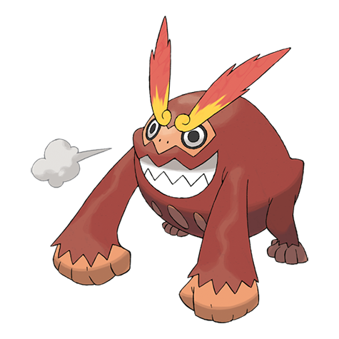

# Darmanitan (#0555)

*Blazing Pokemon*

**Type:** Fuoco
**Abilities:** [[Sheer Force]], [[Zen Mode]] *(Hidden)*
**Base HP:** 5

> This Pokemon is shrouded in mystery as old writings and mural paintings describe it as being blue and using psychic powers, but years of study have not seen those traits on this Pokemon that relies on brute force.

---

## Statistiche (Attributes & Limits)

| Attribute | Base / Limit |
|---|---|
| **Strength** | 3/7 |
| **Dexterity** | 2/5 |
| **Vitality** | 2/4 |
| **Special** | 1/3 |
| **Insight** | 2/4 |

---

## Mosse (Learnset)

- **Starter:** [[Tackle|Tackle]], [[Rollout|Rollout]]
- **Beginner:** [[Incinerate|Incinerate]], [[Rage|Rage]], [[Fire_Fang|Fire Fang]]
- **Amateur:** [[Headbutt|Headbutt]], [[Swagger|Swagger]], [[Facade|Facade]], [[Fire_Punch|Fire Punch]], [[Work_Up|Work Up]], [[Taunt|Taunt]], [[Belly_Drum|Belly Drum]]
- **Ace:** [[Thrash|Thrash]], [[Hammer_Arm|Hammer Arm]], [[Flare_Blitz|Flare Blitz]], [[Superpower|Superpower]], [[Overheat|Overheat]]
- **Pro:** [[Heat_Wave|Heat Wave]], [[Zen_Headbutt|Zen Headbutt]], [[Psychic|Psychic]]

---

## Correlati

### Catena Evolutiva
- [[0554_Darumaka|Darumaka]]
- [[0555_Darmanitan|Darmanitan]]
- Darmanitan (Zen Form)

---

## Darmanitan (Forma Zen) (#0555F1)

**Type:** Fuoco / Psico
**Abilities:** [[Zen Mode]]
**Base HP:** 5

| Attribute | Base / Limit |
|---|---|
| **Strength** | 1/3 |
| **Dexterity** | 2/4 |
| **Vitality** | 3/6 |
| **Special** | 3/7 |
| **Insight** | 3/6 |

### Mosse

- **Starter:** [[Tackle|Tackle]], [[Rollout|Rollout]]
- **Beginner:** [[Incinerate|Incinerate]], [[Rage|Rage]], [[Fire_Fang|Fire Fang]]
- **Amateur:** [[Headbutt|Headbutt]], [[Swagger|Swagger]], [[Facade|Facade]], [[Fire_Punch|Fire Punch]], [[Work_Up|Work Up]], [[Taunt|Taunt]], [[Belly_Drum|Belly Drum]]
- **Ace:** [[Thrash|Thrash]], [[Hammer_Arm|Hammer Arm]], [[Flare_Blitz|Flare Blitz]], [[Superpower|Superpower]], [[Overheat|Overheat]]
- **Pro:** [[Heat_Wave|Heat Wave]], [[Zen_Headbutt|Zen Headbutt]], [[Psychic|Psychic]]

---

## Darmanitan (Forma Galar) (#0555G)

**Type:** Ghiaccio
**Abilities:** [[Gorilla Tactics]], [[Zen Mode]]
**Base HP:** 4

| Attribute | Base / Limit |
|---|---|
| **Strength** | 3/6 |
| **Dexterity** | 2/4 |
| **Vitality** | 3/6 |
| **Special** | 1/3 |
| **Insight** | 2/4 |

### Mosse

- **Starter:** [[Tackle|Tackle]], [[Taunt|Taunt]]
- **Beginner:** [[Bite|Bite]], [[Powder_Snow|Powder Snow]]
- **Amateur:** [[Avalanche|Avalanche]], [[Work_Up|Work Up]], [[Ice_Fang|Ice Fang]], [[Headbutt|Headbutt]], [[Ice_Punch|Ice Punch]], [[Uproar|Uproar]]
- **Ace:** [[Belly_Drum|Belly Drum]], [[Blizzard|Blizzard]], [[Thrash|Thrash]], [[Superpower|Superpower]], [[Icicle_Crash|Icicle Crash]]
- **Pro:** [[Thief|Thief]], [[Bulldoze|Bulldoze]], [[Freeze_Dry|Freeze Dry]]

---

## Darmanitan (Forma Galar Zen) (#0555GF1)

**Type:** Ghiaccio / Fuoco
**Abilities:** [[Gorilla Tactics]], [[Zen Mode]]
**Base HP:** 4

| Attribute | Base / Limit |
|---|---|
| **Strength** | 4/8 |
| **Dexterity** | 3/7 |
| **Vitality** | 2/4 |
| **Special** | 1/3 |
| **Insight** | 2/4 |

### Mosse

- **Starter:** [[Tackle|Tackle]], [[Taunt|Taunt]]
- **Beginner:** [[Bite|Bite]], [[Powder_Snow|Powder Snow]]
- **Amateur:** [[Avalanche|Avalanche]], [[Work_Up|Work Up]], [[Ice_Fang|Ice Fang]], [[Headbutt|Headbutt]], [[Ice_Punch|Ice Punch]], [[Uproar|Uproar]]
- **Ace:** [[Belly_Drum|Belly Drum]], [[Blizzard|Blizzard]], [[Thrash|Thrash]], [[Superpower|Superpower]], [[Icicle_Crash|Icicle Crash]]
- **Pro:** [[Sunny_Day|Sunny Day]], [[Flare_Blitz|Flare Blitz]], [[Fire_Fang|Fire Fang]]

