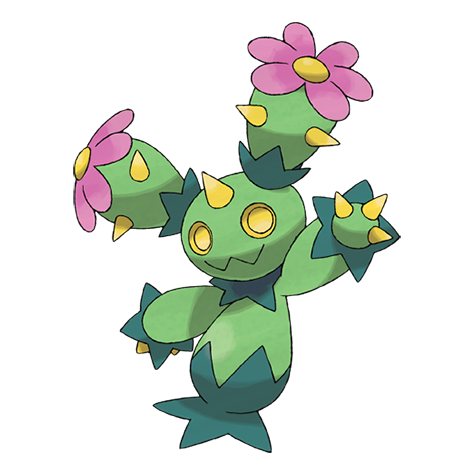

# Maractus (#0556)

*Cactus Pokemon*

**Type:** Erba
**Abilities:** [[Water Absorb]], [[Chlorophyll]], [[Storm Drain]] *(Hidden)*
**Base HP:** 4

> If you see a Maractus on the desert, follow it, as they make their nests on water oasis. This pacific Pokemon makes a sound similar to a maraca to drive away bird Pokemon that prey on it’s seeds and fruit.

---

## Statistiche (Attributes & Limits)

| Attribute | Base / Limit |
|---|---|
| **Strength** | 2/5 |
| **Dexterity** | 2/4 |
| **Vitality** | 2/4 |
| **Special** | 3/6 |
| **Insight** | 2/4 |

---

## Mosse (Learnset)

- **Starter:** [[Peck|Peck]], [[Absorb|Absorb]], [[Growth|Growth]]
- **Beginner:** [[Sweet_Scent|Sweet Scent]], [[Spiky_Shield|Spiky Shield]], [[Pin_Missile|Pin Missile]]
- **Amateur:** [[Mega_Drain|Mega Drain]], [[Synthesis|Synthesis]], [[Cotton_Spore|Cotton Spore]], [[Needle_Arm|Needle Arm]], [[Ingrain|Ingrain]], [[Acupressure|Acupressure]], [[Sucker_Punch|Sucker Punch]], [[Petal_Dance|Petal Dance]]
- **Ace:** [[Giga_Drain|Giga Drain]], [[After_You|After You]], [[Petal_Blizzard|Petal Blizzard]], [[Solar_Beam|Solar Beam]], [[Cotton_Guard|Cotton Guard]], [[Sunny_Day|Sunny Day]]
- **Pro:** [[Drain_Punch|Drain Punch]], [[Spikes|Spikes]], [[Worry_Seed|Worry Seed]]

---

