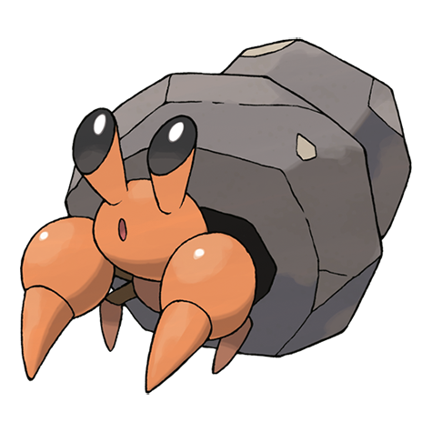

# Dwebble (#0557)

*Rock Inn Pokemon*

**Type:** Insetto / Roccia
**Abilities:** [[Sturdy]], [[Shell Armor]], [[Weak Armor]] *(Hidden)*
**Base HP:** 3

> Their saliva is corrosive and it uses it to slowly cut pieces of rock. The rock becomes a shelter until it grows too large for it. If the rock breaks, it stays anxious and agitated until it finds a replacement.

---

## Statistiche (Attributes & Limits)

| Attribute | Base / Limit |
|---|---|
| **Strength** | 2/4 |
| **Dexterity** | 2/4 |
| **Vitality** | 2/5 |
| **Special** | 1/3 |
| **Insight** | 1/3 |

---

## Mosse (Learnset)

- **Starter:** [[Fury_Cutter|Fury Cutter]], [[Rock_Blast|Rock Blast]]
- **Beginner:** [[Withdraw|Withdraw]], [[Sand_Attack|Sand Attack]]
- **Amateur:** [[Feint_Attack|Feint Attack]], [[Smack_Down|Smack Down]], [[Rock_Polish|Rock Polish]], [[Bug_Bite|Bug Bite]], [[Stealth_Rock|Stealth Rock]], [[Rock_Slide|Rock Slide]], [[Slash|Slash]]
- **Ace:** [[X_Scissor|X-Scissor]], [[Shell_Smash|Shell Smash]], [[Flail|Flail]], [[Rock_Wrecker|Rock Wrecker]]
- **Pro:** [[Iron_Defense|Iron Defense]], [[Spikes|Spikes]], [[Night_Slash|Night Slash]]

---

## Correlati

### Catena Evolutiva
- [[0557_Dwebble|Dwebble]]
- [[0558_Crustle|Crustle]]

