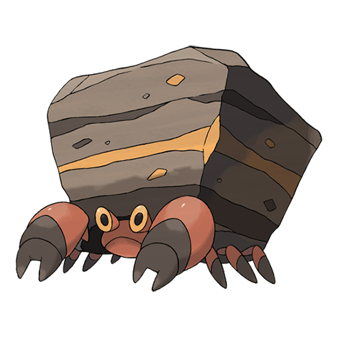

# Crustle (#0558)

*Stone Home Pokemon*

**Type:** Insetto / Roccia
**Abilities:** [[Sturdy]], [[Shell Armor]], [[Weak Armor]] *(Hidden)*
**Base HP:** 4

> They carry enormous boulders as a protective shell. When competing for territory, Crustle fight viciously. The one whose boulder is broken is the loser of the battle. They feed on the moss that grows in their rock.

---

## Statistiche (Attributes & Limits)

| Attribute | Base / Limit |
|---|---|
| **Strength** | 3/6 |
| **Dexterity** | 2/4 |
| **Vitality** | 3/7 |
| **Special** | 2/4 |
| **Insight** | 2/5 |

---

## Mosse (Learnset)

- **Starter:** [[Fury_Cutter|Fury Cutter]], [[Rock_Blast|Rock Blast]]
- **Beginner:** [[Withdraw|Withdraw]], [[Sand_Attack|Sand Attack]]
- **Amateur:** [[Feint_Attack|Feint Attack]], [[Smack_Down|Smack Down]], [[Rock_Polish|Rock Polish]], [[Bug_Bite|Bug Bite]], [[Stealth_Rock|Stealth Rock]], [[Rock_Slide|Rock Slide]], [[Slash|Slash]]
- **Ace:** [[X_Scissor|X-Scissor]], [[Shell_Smash|Shell Smash]], [[Flail|Flail]], [[Rock_Wrecker|Rock Wrecker]]
- **Pro:** [[Iron_Defense|Iron Defense]], [[Wide_Guard|Wide Guard]], [[Night_Slash|Night Slash]]

---

## Correlati

### Catena Evolutiva
- [[0557_Dwebble|Dwebble]]
- [[0558_Crustle|Crustle]]

