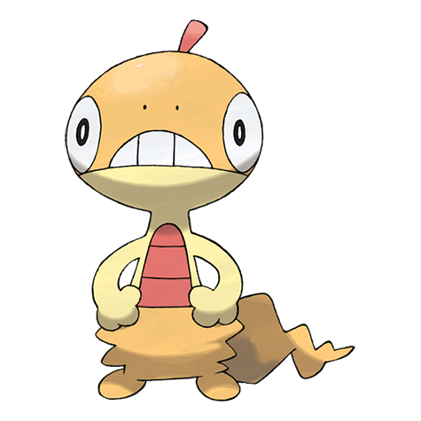

# Scraggy (#0559)

*Shedding Pokemon*

**Type:** Buio / Lotta
**Abilities:** [[Shed Skin]], [[Moxie]], [[Intimidate]] *(Hidden)*
**Base HP:** 3

> It sheds skin constantly, but keeps wearing it since the old skin has a rubber-like texture and it can pull it all the way up to its head. It bashes foes with headbutts and is known for making dirty moves on fights.

---

## Statistiche (Attributes & Limits)

| Attribute | Base / Limit |
|---|---|
| **Strength** | 2/5 |
| **Dexterity** | 2/4 |
| **Vitality** | 2/5 |
| **Special** | 1/3 |
| **Insight** | 2/5 |

---

## Mosse (Learnset)

- **Starter:** [[Leer|Leer]], [[Low_Kick|Low Kick]]
- **Beginner:** [[Sand_Attack|Sand Attack]], [[Feint_Attack|Feint Attack]]
- **Amateur:** [[Headbutt|Headbutt]], [[Swagger|Swagger]], [[Brick_Break|Brick Break]], [[Payback|Payback]], [[Chip_Away|Chip Away]], [[High_Jump_Kick|High Jump Kick]], [[Scary_Face|Scary Face]], [[Crunch|Crunch]]
- **Ace:** [[Facade|Facade]], [[Rock_Climb|Rock Climb]], [[Focus_Punch|Focus Punch]], [[Head_Smash|Head Smash]]
- **Pro:** [[Fake_Out|Fake Out]], [[Thunder_Punch|Thunder Punch]], [[Fire_Punch|Fire Punch]]

---

## Correlati

### Catena Evolutiva
- [[0559_Scraggy|Scraggy]]
- [[0560_Scrafty|Scrafty]]

