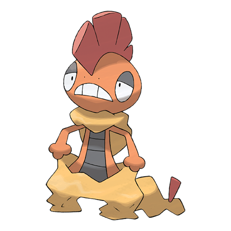

# Scrafty (#0560)

*Hoodlum Pokemon*

**Type:** Buio / Lotta
**Abilities:** [[Shed Skin]], [[Moxie]], [[Intimidate]] *(Hidden)*
**Base HP:** 4

> They form gangs and beat anyone who trespasses their territory. The one with the biggest crest is the leader. They throw powerful kicks and their skin is an excellent shield. Be careful around them.

---

## Statistiche (Attributes & Limits)

| Attribute | Base / Limit |
|---|---|
| **Strength** | 2/5 |
| **Dexterity** | 2/4 |
| **Vitality** | 3/6 |
| **Special** | 2/4 |
| **Insight** | 3/6 |

---

## Mosse (Learnset)

- **Starter:** [[Leer|Leer]], [[Low_Kick|Low Kick]]
- **Beginner:** [[Sand_Attack|Sand Attack]], [[Feint_Attack|Feint Attack]]
- **Amateur:** [[Headbutt|Headbutt]], [[Swagger|Swagger]], [[Brick_Break|Brick Break]], [[Payback|Payback]], [[Chip_Away|Chip Away]], [[High_Jump_Kick|High Jump Kick]], [[Scary_Face|Scary Face]], [[Crunch|Crunch]]
- **Ace:** [[Facade|Facade]], [[Rock_Climb|Rock Climb]], [[Focus_Punch|Focus Punch]], [[Head_Smash|Head Smash]]
- **Pro:** [[Dragon_Dance|Dragon Dance]], [[Drain_Punch|Drain Punch]], [[Iron_Defense|Iron Defense]]

---

## Correlati

### Catena Evolutiva
- [[0559_Scraggy|Scraggy]]
- [[0560_Scrafty|Scrafty]]

